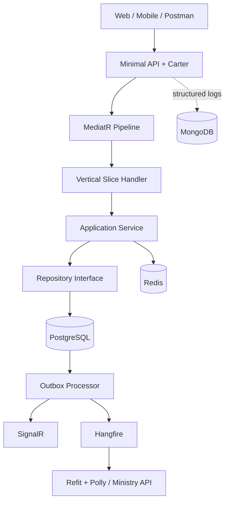
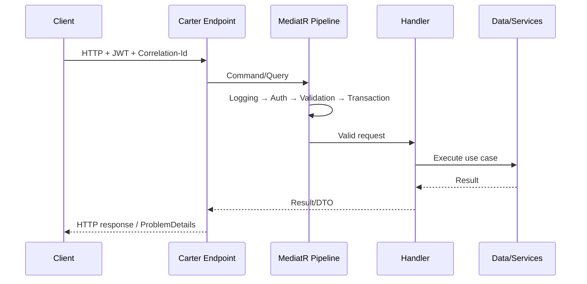
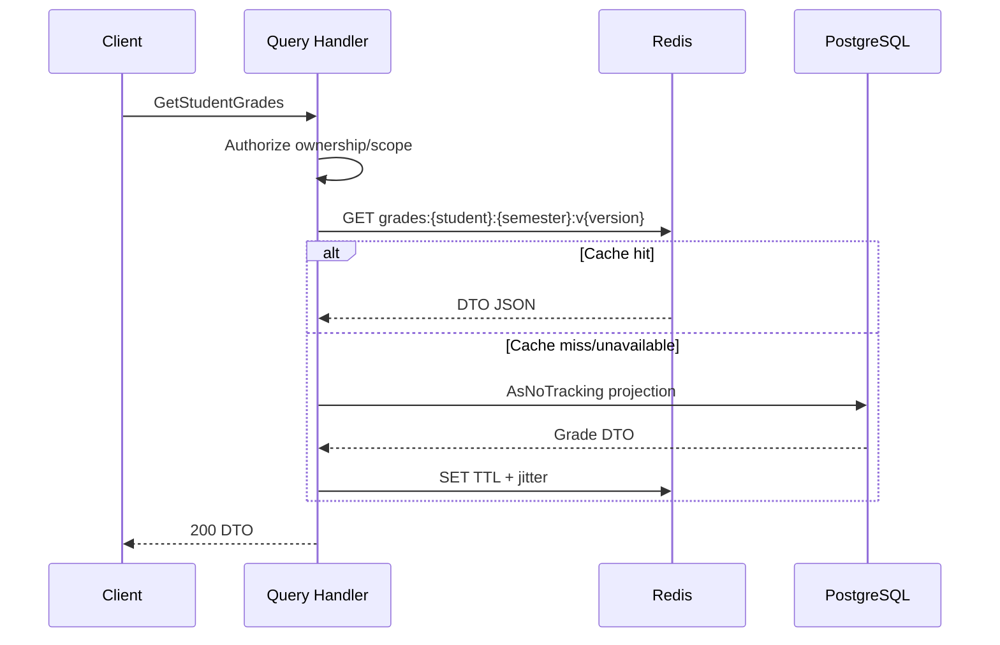

# EduHub Portal — Architecture & Code Flow Specification

> **Mục đích:** Đây là tài liệu nguồn để Codex triển khai code. Khi có mâu thuẫn giữa code và tài liệu này, ưu tiên tài liệu này cùng `EduHub_02_Business_Rules_and_Test_Cases.md`.
>
> **Nguồn yêu cầu:** `detai.md` — ASP.NET Core 10, C# 14, Minimal API + Carter, Vertical Slice, CQRS/MediatR, FluentValidation, Mapster, PostgreSQL/EF Core, Redis, MongoDB/Serilog, SignalR, Hangfire, Refit/Polly, Swagger/OpenAPI và xUnit.

---

## 1. Phạm vi và các quyết định đã chốt

### 1.1 Phạm vi MVP đầy đủ

Hệ thống quản lý:

1. Xác thực và phân quyền người dùng.
2. Học sinh, phụ huynh và quan hệ phụ huynh–học sinh.
3. Năm học, học kỳ, môn học, lớp học và phân công giáo viên.
4. Ghi danh học sinh vào lớp.
5. Cấu hình thành phần điểm, nhập/sửa/chốt/mở lại điểm.
6. Tính GPA và xếp loại học lực.
7. Tra cứu bảng điểm có Redis cache.
8. Thông báo real-time cho phụ huynh bằng SignalR.
9. Email cuối ngày và email tổng hợp 23:00 Chủ Nhật bằng Hangfire.
10. Xuất PDF bảng điểm/báo cáo bằng Hangfire.
11. Đồng bộ Bộ Giáo Dục qua Refit + Polly.
12. Audit log dạng document trong MongoDB qua Serilog.
13. Chương trình 35 tuần theo khối, quota môn theo năm/học kỳ và phân bổ vào từng tuần thực học.
14. Năng lực giáo viên, phân công giáo viên bộ môn và giáo viên chủ nhiệm.
15. Sinh, chỉnh tay, khóa và công bố thời khóa biểu sáng/chiều bằng OR-Tools CP-SAT.
16. Học sinh gửi yêu cầu sửa hồ sơ kèm ảnh bằng chứng để học vụ duyệt.
17. Import Excel học sinh, phụ huynh, liên kết gia đình và ghi danh.

### 1.2 Quyết định bổ sung cần thiết để hệ thống an toàn

Các nội dung dưới đây không thay đổi công nghệ đề bài mà làm rõ cách triển khai:

- PostgreSQL là **source of truth** duy nhất cho dữ liệu học vụ.
- Redis chỉ là cache; mất Redis không được làm mất dữ liệu nghiệp vụ.
- MongoDB chỉ chứa audit/technical log; lỗi MongoDB không rollback giao dịch học vụ.
- Dùng JWT Bearer cho API và authorization policy theo vai trò/phạm vi dữ liệu.
- Dùng optimistic concurrency (`xmin` hoặc concurrency token) khi sửa điểm.
- Dùng **Transactional Outbox** trong PostgreSQL để bảo đảm sự kiện chỉ được phát sau khi transaction ghi điểm thành công.
- Consumer/job phải idempotent để retry không tạo thông báo, email hoặc đồng bộ trùng.
- Mọi thời gian lưu UTC; chỉ đổi sang `Asia/Ho_Chi_Minh` ở giao diện, email và lịch Hangfire.
- ID nội bộ dùng UUID; mã nghiệp vụ (`StudentCode`, `ClassCode`, `SubjectCode`) là chuỗi unique, không dùng làm khóa chính.
- Xóa dữ liệu master theo soft delete/disable nếu đã được tham chiếu; không hard-delete lịch sử điểm.
- API lỗi theo RFC 9457 `ProblemDetails`; validation trả danh sách lỗi theo field.

### 1.3 Ngoài phạm vi MVP

- Native mobile app; hệ thống hiện có public site và role-based web portal.
- Học phí, điểm danh, tuyển sinh, thư viện, quản lý phòng học/ngày lễ.
- Phân ban tự nhiên/xã hội và ràng buộc phòng chuyên môn sẽ được thiết kế ở giai đoạn sau.
- SSO quốc gia thật; external Ministry API dùng adapter và có thể chạy mock/sandbox.
- Chỉnh sửa trực tiếp PDF đã sinh.

---

## 2. Actors, roles và phạm vi quyền

| Actor/Role | Quyền chính | Giới hạn bắt buộc |
|---|---|---|
| `SystemAdmin` | Quản lý tài khoản, role, cấu hình hệ thống | Không tự sửa điểm nếu không đồng thời có quyền học vụ |
| `AcademicAdmin` | Quản lý năm/học kỳ/môn/lớp, ghi danh, mở khóa điểm | Mọi hành động nhạy cảm phải có lý do và audit |
| `Teacher` | Xem lớp được phân công, nhập/sửa/chốt điểm | Chỉ lớp/môn được phân công, chỉ trong cửa sổ nhập điểm |
| `Parent` | Xem điểm/thông báo/PDF của con | Chỉ học sinh có quan hệ phụ huynh đang hiệu lực |
| `Student` | Xem dữ liệu và bảng điểm của chính mình | Read-only |
| `IntegrationService` | Gọi endpoint nội bộ dành cho job/sync | Service credential riêng, scope tối thiểu |

Authorization phải kiểm tra cả **role** lẫn **resource ownership**. Có role `Teacher` không đồng nghĩa được sửa mọi lớp.

---

## 3. Kiến trúc tổng thể



### 3.1 Dependency rule

```text
EduHub.Domain        -> không phụ thuộc project khác
EduHub.Application   -> Domain
EduHub.Infrastructure-> Application + Domain
EduHub.WebApi        -> Application + Infrastructure
Tests                -> project đang kiểm thử
```

- Domain không tham chiếu EF Core, Redis, MongoDB, Hangfire, Refit hay ASP.NET.
- Application định nghĩa interface/port; Infrastructure implement.
- WebApi chỉ cấu hình DI, middleware, Carter modules, auth, SignalR và health checks.
- Handler không gọi handler khác qua HTTP; dùng service/domain method hoặc publish event.

### 3.2 CQRS convention

- Command thay đổi trạng thái và trả `Result<T>` nhỏ: ID, version hoặc job ID.
- Query không thay đổi trạng thái và trả DTO/paged result.
- Command chạy transaction PostgreSQL khi chạm nhiều bảng/outbox.
- Query ưu tiên `AsNoTracking`, projection trực tiếp sang DTO và cache khi phù hợp.
- Không dùng repository generic che khuất nghiệp vụ; mỗi module dùng repository interface chuyên biệt.
- Convention hiện tại: `Endpoint -> DTO/Mapping -> Feature Handler -> Service Interface -> Application Service -> Repository Interface -> Infrastructure Repository -> ApplicationDbContext`.

---

## 4. Cấu trúc solution bắt buộc

```text
EduHub.sln
├── src/
│   ├── EduHub.Domain/
│   │   ├── Common/{BaseEntity,AuditableEntity,DomainEvent}.cs
│   │   ├── Enums/{UserRole,EnrollmentStatus,GradeStatus,...}.cs
│   │   ├── Entities/
│   │   │   ├── Identity/{User,RefreshToken}.cs
│   │   │   ├── Students/{Student,ParentStudent}.cs
│   │   │   ├── Academics/{AcademicYear,Semester,Subject,ClassRoom,TeachingAssignment,Enrollment}.cs
│   │   │   ├── Grades/{GradeComponent,GradeEntry,GradeChangeHistory,ReportCard}.cs
│   │   │   └── Integration/{OutboxMessage,ExternalSyncRecord}.cs
│   │   ├── Events/{GradeChangedEvent,GradesPublishedEvent,...}.cs
│   │   └── Exceptions/DomainException.cs
│   ├── EduHub.Application/
│   │   ├── Abstractions/
│   │   │   ├── Data/IApplicationDbContext.cs
│   │   │   ├── Cache/ICacheService.cs
│   │   │   ├── Identity/{ICurrentUser,IJwtTokenService,IPasswordHasher}.cs
│   │   │   ├── Messaging/{IOutboxWriter,IRealtimeNotifier}.cs
│   │   │   ├── Jobs/{IBackgroundJobScheduler,IReportGenerator}.cs
│   │   │   └── Integrations/IEducationMinistryGateway.cs
│   │   ├── Common/
│   │   │   ├── Behaviors/{Validation,Logging,Authorization,Performance,Transaction}Behavior.cs
│   │   │   ├── Models/{Result,Error,PagedResult}.cs
│   │   │   └── Mapping/MapsterConfig.cs
│   │   └── Features/<Feature>/<UseCase>/
│   │       ├── <UseCase>CommandOrQuery.cs
│   │       ├── <UseCase>Validator.cs
│   │       ├── <UseCase>Handler.cs
│   │       ├── <UseCase>Response.cs
│   │       └── <UseCase>Mapping.cs
│   ├── EduHub.Infrastructure/
│   │   ├── Persistence/{ApplicationDbContext,Configurations,Migrations,Seed}.cs
│   │   ├── Cache/{RedisCacheService,CacheKeys}.cs
│   │   ├── Audit/{MongoSerilogConfiguration,AuditEnricher}.cs
│   │   ├── Identity/{JwtTokenService,PasswordHasher}.cs
│   │   ├── Messaging/{OutboxProcessor,SignalRRealtimeNotifier}.cs
│   │   ├── Jobs/{HangfireJobScheduler,WeeklyDigestJob,DailyGradeEmailJob,PdfReportJob}.cs
│   │   ├── Integrations/{EducationMinistryRefitClient,EducationMinistryGateway,PollyPolicies}.cs
│   │   ├── Reports/PdfReportGenerator.cs
│   │   └── DependencyInjection.cs
│   └── EduHub.WebApi/
│       ├── Modules/{Auth,Students,Academics,Grades,Reports,Notifications,Admin}Module.cs
│       ├── Hubs/NotificationHub.cs
│       ├── Middleware/{ExceptionHandling,CorrelationId}Middleware.cs
│       ├── OpenApi/
│       ├── Program.cs
│       ├── appsettings.json
│       └── appsettings.Development.json
├── tests/
│   ├── EduHub.UnitTests/
│   ├── EduHub.IntegrationTests/
│   └── EduHub.ArchitectureTests/
├── docker-compose.yml
├── .env.example
├── Directory.Packages.props
└── README.md
```

---

## 5. Domain model và ràng buộc dữ liệu

### 5.1 Entity chính

| Entity | Trường quan trọng | Ràng buộc DB |
|---|---|---|
| `User` | Id, Email, PasswordHash, Role, IsActive | Email unique, normalized |
| `Student` | Id, StudentCode, FullName, DateOfBirth, Status | StudentCode unique |
| `ParentStudent` | ParentUserId, StudentId, Relationship, IsActive | unique cặp parent–student |
| `AcademicYear` | Name, StartDate, EndDate, Status | không overlap với năm học active khác |
| `Semester` | AcademicYearId, Name, StartDate, EndDate, GradeEntryFrom/To | unique tên trong năm học |
| `Subject` | SubjectCode, Name, Credits, IsActive | SubjectCode unique; Credits > 0 |
| `ClassRoom` | ClassCode, Name, AcademicYearId, GradeLevel, Capacity | ClassCode unique theo năm học |
| `TeachingAssignment` | ClassId, SubjectId, TeacherId, SemesterId, IsActive | unique active assignment |
| `Enrollment` | StudentId, ClassId, SemesterId, Status, EnrolledAt | unique active enrollment |
| `GradeComponent` | SubjectId, SemesterId, Name, Weight, MaxScore, Order | tổng Weight theo cấu hình = 100% |
| `GradeEntry` | StudentId, AssignmentId, ComponentId, Score, Status, Version | unique student–assignment–component |
| `GradeChangeHistory` | GradeEntryId, OldScore, NewScore, Reason, ChangedBy, ChangedAt | append-only |
| `ReportCard` | StudentId, SemesterId, Status, GeneratedAt, StorageKey | unique version hiện hành |
| `OutboxMessage` | Id, Type, Payload, OccurredAt, ProcessedAt, RetryCount | index ProcessedAt/OccurredAt |
| `ExternalSyncRecord` | AggregateId, Version, Status, Attempts, ExternalId | idempotency unique aggregate+version |

### 5.2 Enum/status chính

```text
StudentStatus: Active, Suspended, Graduated, Withdrawn
EnrollmentStatus: Pending, Active, Completed, Withdrawn, Rejected
GradeStatus: Draft, Submitted, Published, Locked
SemesterStatus: Planned, Active, GradeEntryClosed, Completed
ReportJobStatus: Queued, Processing, Completed, Failed, Expired
SyncStatus: Pending, Processing, Succeeded, RetryScheduled, FailedPermanent
```

### 5.3 Index tối thiểu

- `users(normalized_email)` unique.
- `students(student_code)` unique.
- `class_rooms(academic_year_id, class_code)` unique.
- `teaching_assignments(semester_id, class_id, subject_id, teacher_id)` unique theo active rule.
- `enrollments(semester_id, class_id, student_id)` unique.
- `grade_entries(student_id, assignment_id, component_id)` unique.
- `grade_entries(assignment_id, status)` để load sổ điểm.
- `outbox_messages(processed_at, occurred_at)`.
- `external_sync_records(status, next_retry_at)`.

---

## 6. Pipeline của mọi request



Thứ tự behavior:

1. `LoggingBehavior`: correlation ID, use case, duration; không log password/token/PII nhạy cảm.
2. `AuthorizationBehavior`: policy và resource scope.
3. `ValidationBehavior`: FluentValidation; fail-fast trước DB write.
4. `PerformanceBehavior`: warning khi vượt ngưỡng.
5. `TransactionBehavior`: chỉ cho command; commit dữ liệu và outbox trong cùng transaction.

Exception middleware ánh xạ:

| Exception/kết quả | HTTP |
|---|---:|
| Validation failure | 400 |
| JWT thiếu/sai/hết hạn | 401 |
| Không đủ quyền/phạm vi | 403 |
| Không tìm thấy | 404 |
| Duplicate/business conflict | 409 |
| Concurrency conflict | 409 |
| Rate limit | 429 |
| External dependency unavailable ở synchronous API | 503 |
| Lỗi không dự kiến | 500 + traceId, không lộ stack trace |

---

## 7. API contract tổng quan

Prefix `/api/v1`. Tất cả endpoint trừ login/refresh/health yêu cầu JWT.

### 7.1 Auth

| Method | Route | Use case |
|---|---|---|
| POST | `/auth/login` | Login, nhận access + refresh token |
| POST | `/auth/refresh` | Rotate refresh token |
| POST | `/auth/logout` | Revoke refresh token hiện tại |

### 7.2 Students/parents

| Method | Route | Use case |
|---|---|---|
| POST | `/students` | Tạo học sinh |
| GET | `/students/{id}` | Chi tiết theo quyền |
| GET | `/students` | Filter/search/paging |
| PUT | `/students/{id}` | Cập nhật hồ sơ + concurrency token |
| POST | `/students/{id}/parents/{parentUserId}` | Gắn phụ huynh |
| DELETE | `/students/{id}/parents/{parentUserId}` | Ngừng quan hệ, không xóa lịch sử |

### 7.3 Academic setup

| Method | Route | Use case |
|---|---|---|
| POST/GET | `/academic-years` | Tạo/list năm học |
| POST/GET | `/semesters` | Tạo/list học kỳ |
| POST/GET/PUT | `/subjects` | Quản lý môn |
| POST/GET/PUT | `/classes` | Quản lý lớp |
| POST | `/classes/{classId}/assignments` | Phân công giáo viên–môn–học kỳ |
| POST | `/classes/{classId}/enrollments` | Ghi danh một học sinh |
| POST | `/classes/{classId}/enrollments:bulk` | Ghi danh hàng loạt có kết quả từng dòng |

### 7.4 Grades

| Method | Route | Use case |
|---|---|---|
| PUT | `/grades/{gradeEntryId}` | Sửa một điểm; `If-Match`/version bắt buộc |
| PUT | `/assignments/{assignmentId}/grades:bulk` | Lưu nháp nhiều điểm atomically hoặc theo mode khai báo |
| POST | `/assignments/{assignmentId}/grades:submit` | Giáo viên nộp sổ điểm |
| POST | `/assignments/{assignmentId}/grades:publish` | AcademicAdmin công bố điểm |
| POST | `/assignments/{assignmentId}/grades:reopen` | Mở lại có lý do |
| GET | `/students/{studentId}/grades?semesterId=` | Bảng điểm; cache-aside |
| GET | `/students/{studentId}/transcript` | Bảng điểm toàn khóa |

### 7.5 Reports/notifications/integration

| Method | Route | Use case |
|---|---|---|
| POST | `/reports/report-cards` | Queue PDF job; trả 202 + jobId |
| GET | `/reports/jobs/{jobId}` | Trạng thái job |
| GET | `/reports/jobs/{jobId}/download` | Link tải có hạn và kiểm tra quyền |
| GET | `/notifications` | Danh sách thông báo của current user |
| PUT | `/notifications/{id}/read` | Đánh dấu đã đọc |
| POST | `/admin/sync/grades/{assignmentId}` | Retry/manual sync có audit |
| GET | `/health/live` | Process sống |
| GET | `/health/ready` | PostgreSQL/Redis/Hangfire readiness; Mongo/external có thể degraded |

### 7.6 Carter module pattern

Mỗi module:

- implements `ICarterModule`;
- map route group, `.RequireAuthorization(...)`, `.WithTags(...)`, `.WithOpenApi()`;
- map request sang command bằng Mapster;
- gọi `ISender.Send(...)`;
- dùng một `ToHttpResult()` thống nhất;
- không chứa business logic hoặc truy cập DbContext trực tiếp.

---

## 8. Luồng code chi tiết theo use case

### Flow 1 — Login và refresh token

1. `AuthModule` nhận email/password.
2. `LoginCommandValidator` kiểm tra format/rỗng/độ dài.
3. Handler chuẩn hóa email, lấy `User` active từ PostgreSQL.
4. Verify password hash bằng `IPasswordHasher`; thông báo lỗi chung, không tiết lộ email tồn tại.
5. Sinh access JWT ngắn hạn và refresh token ngẫu nhiên; chỉ lưu hash refresh token.
6. Ghi audit login success/failure đã mask dữ liệu.
7. Refresh phải rotate token: token cũ bị revoke ngay sau khi dùng.

### Flow 2 — Tạo học sinh

1. `POST /students` → `CreateStudentRequest`.
2. Mapster → `CreateStudentCommand`.
3. Validator: mã, tên, ngày sinh, dữ liệu bắt buộc.
4. Policy: `AcademicAdmin`.
5. Handler kiểm tra `StudentCode` không trùng, tạo aggregate.
6. EF Core insert PostgreSQL; thêm `StudentCreatedEvent` vào outbox cùng transaction.
7. Commit, trả `201 Created` + location + DTO.
8. Outbox processor xử lý các side effect không chặn response.

### Flow 3 — Tạo lớp, phân công giáo viên và ghi danh

1. Admin tạo năm học/học kỳ/môn/lớp theo thứ tự dependency.
2. Khi phân công: kiểm tra teacher active, subject active, semester hợp lệ và assignment không trùng.
3. Khi ghi danh: kiểm tra student active, lớp chưa đủ capacity, học kỳ/lớp đang nhận ghi danh và không trùng.
4. Bulk enrollment trả tổng `accepted/rejected` và lỗi theo `studentCode`; mode mặc định `partial-success`, nhưng mỗi dòng là transaction độc lập.
5. Khi chuyển lớp, đóng enrollment cũ và tạo enrollment mới; không sửa đè lịch sử.

### Flow 4 — Query bảng điểm với Redis cache-aside



Rules:

- Authorization chạy trước khi trả cache.
- Cache key phải chứa student ID, semester ID và schema/version.
- Chỉ cache điểm `Published/Locked` cho Parent/Student; Teacher/Admin có thể cần draft và key riêng theo view.
- Redis timeout ngắn; lỗi Redis fallback PostgreSQL, không trả 500.
- Chống cache stampede bằng distributed lock hoặc `GetOrCreate` single-flight.

### Flow 5 — Giáo viên sửa điểm (luồng trọng tâm đề bài)

1. `PUT /api/v1/grades/{id}` nhận `score`, `reason`, `version`/`If-Match` và `Idempotency-Key`.
2. Carter + Mapster tạo `UpdateGradeCommand`.
3. Pipeline xác thực JWT, policy Teacher/AcademicAdmin và FluentValidation `0 <= score <= component.MaxScore` (chuẩn hệ thống thường 0–10).
4. Handler load `GradeEntry`, assignment, semester, enrollment và component.
5. Kiểm tra teacher được phân công, học sinh thuộc lớp, cửa sổ nhập điểm còn mở, grade chưa locked.
6. So sánh version; lệch version trả 409 kèm version hiện hành, không ghi đè.
7. Domain method `grade.UpdateScore(...)` chuẩn hóa precision, yêu cầu lý do nếu sửa điểm đã Submit/Published.
8. Thêm `GradeChangeHistory` append-only.
9. Trong **một transaction PostgreSQL**: update grade + history + thêm `GradeChangedEvent` vào outbox.
10. Commit thành công mới trả `200` với score/version mới.
11. Outbox consumer idempotently:
    - xóa cache bảng điểm liên quan;
    - nếu grade Published, gửi SignalR tới group phụ huynh/học sinh;
    - enqueue email cuối ngày qua Hangfire;
    - enqueue external sync record;
    - đánh dấu outbox processed.
12. Refit gateway sync; Polly retry transient 3 lần với exponential backoff + jitter, circuit breaker khi lỗi liên tiếp. Lỗi sync không rollback điểm nội bộ.
13. Serilog ghi request/result/correlation ID vào MongoDB, mask score history theo chính sách truy cập log.

### Flow 6 — Bulk nhập điểm

1. Request chứa assignment ID, component ID, danh sách `{studentId, score, version}`.
2. Giới hạn batch (ví dụ 200 dòng); duplicate student trong request là 400.
3. Mặc định `atomic=true`: chỉ một dòng sai thì không lưu dòng nào.
4. Handler preload assignment, enrollments và existing grades bằng một số query hữu hạn, không N+1.
5. Validate tất cả dòng, update/create entries, histories và một outbox event dạng batch.
6. `SaveChanges` một transaction; trả version mới cho từng row.
7. Với `atomic=false` nếu được bật, response `207 Multi-Status`/200 envelope phải chỉ rõ success/failure từng dòng; không được im lặng bỏ qua.

### Flow 7 — Submit, publish, reopen và lock điểm

1. Teacher submit khi mọi component bắt buộc đã có điểm hợp lệ.
2. Handler tính điểm tổng/GPA và kiểm tra tổng weight = 100%.
3. Chuyển Draft → Submitted trong transaction; teacher không sửa tiếp.
4. AcademicAdmin review và Publish; tạo outbox `GradesPublishedEvent`.
5. Publish làm invalidation cache, SignalR, email và external sync.
6. Sau thời hạn quy định, Hangfire job chuyển Published → Locked.
7. Reopen chỉ AcademicAdmin, bắt buộc lý do; Locked → Draft/Submitted theo quyết định cấu hình; audit đầy đủ.
8. Republish tạo version mới và gửi thông báo “điểm được điều chỉnh”, không giả như bản công bố đầu tiên.

### Flow 8 — SignalR notification

1. Client kết nối `/hubs/notifications` bằng JWT.
2. `OnConnectedAsync` lấy current user và chỉ join group server-side: `user:{userId}`; client không tự chọn group học sinh.
3. Khi outbox grade event được xử lý, service tìm ParentStudent active và student user.
4. Lưu notification record trước, sau đó push payload tối thiểu `{notificationId,type,studentId,occurredAt}`.
5. Client nhận event rồi gọi query có authorization để lấy chi tiết.
6. Client offline vẫn thấy notification từ DB khi kết nối lại.

### Flow 9 — Email cuối ngày và tổng hợp Chủ Nhật 23:00

1. Grade events trong ngày tạo/merge một digest record theo recipient/date.
2. Hangfire recurring job chạy theo timezone `Asia/Ho_Chi_Minh`.
3. Job lấy published changes chưa gửi, render template và gửi email.
4. Idempotency key `recipient + digestPeriod + templateVersion` ngăn gửi trùng.
5. Retry transient có giới hạn; lỗi permanent (email invalid) đánh dấu và audit.
6. Weekly job 23:00 Chủ Nhật tổng hợp GPA, thay đổi và cảnh báo; không gửi nếu không có dữ liệu trừ khi cấu hình yêu cầu.

### Flow 10 — Xuất PDF lớn bằng Hangfire

1. User gọi `POST /reports/report-cards`.
2. API authorize, validate scope, tạo `ReportJob` và enqueue Hangfire; trả `202 Accepted`, `jobId`, status URL.
3. Worker đổi Queued → Processing, đọc snapshot dữ liệu từ PostgreSQL.
4. Sinh PDF; lưu file vào storage abstraction; ghi checksum/version.
5. Mark Completed và SignalR `ReportReady` cho requester.
6. Download endpoint kiểm tra owner/role và phát link ngắn hạn; không public file path.
7. Retry chỉ khi an toàn; cùng job ID không tạo nhiều report records. Job thất bại cuối cùng lưu reason đã sanitize.

### Flow 11 — Đồng bộ API Bộ Giáo Dục

1. External sync chỉ chạy sau commit qua outbox/Hangfire.
2. Map domain DTO sang contract versioned của Ministry API bằng Mapster/profile riêng.
3. Gửi `Idempotency-Key = aggregateId:version` và correlation ID.
4. Polly xử lý timeout, retry 3 lần cho timeout/408/429/5xx; tôn trọng `Retry-After`.
5. Không retry 400/401/403/404 trừ khi có refresh credential rõ ràng.
6. Circuit breaker mở sau ngưỡng cấu hình; job chuyển `RetryScheduled`, không mất dữ liệu.
7. Thành công lưu external ID/response version; lỗi permanent đưa vào dead-letter/admin review.
8. Manual retry không tạo version mới và vẫn giữ idempotency key cũ.

### Flow 12 — Audit log MongoDB/Serilog

Mỗi log có: timestamp UTC, level, message template, correlationId, userId, role, useCase, entityType/entityId, action, result, duration, IP hash và exception đã sanitize.

- Không log password, JWT, refresh token, connection string, raw email body hay full request chứa PII.
- Audit nghiệp vụ quan trọng (ai đổi điểm gì, lý do gì) vẫn có bản append-only trong PostgreSQL; Mongo log là quan sát hệ thống, không phải nguồn duy nhất để chứng minh thay đổi điểm.
- Mongo sink nên async/buffered; lỗi sink không làm fail request chính.

---

## 9. GPA và xếp loại

### 9.1 Công thức

Với các thành phần điểm cùng thang 10:

```text
SubjectAverage = Round(sum(Score_i × Weight_i), 2, AwayFromZero)
SemesterGPA    = Round(sum(SubjectAverage_j × Credits_j) / sum(Credits_j), 2, AwayFromZero)
```

- Weight lưu decimal (ví dụ 0.20), tổng chính xác 1.00.
- Không dùng `double`; dùng `decimal`.
- Môn pass/fail hoặc miễn học không được tự ý đưa vào GPA; cần flag cấu hình.
- Xếp loại đặt trong `AcademicClassificationPolicy`, không hard-code rải rác. Mặc định đề xuất: Excellent ≥ 8.5; Good ≥ 7.0; Average ≥ 5.0; Weak < 5.0, nhưng phải coi đây là cấu hình có version cho tới khi nhà trường xác nhận.

---

## 10. Cache strategy

| Dữ liệu | Cache | TTL gợi ý | Invalidate |
|---|---|---:|---|
| Subject catalog | Redis | 24h + jitter | create/update/disable subject |
| Published student grades | Redis | 15m + jitter | grade published/reopened/republished |
| Transcript summary | Redis | 15m + jitter | any published grade change |
| Authorization/parent links | Redis optional | 5m | link/unlink parent, role change |
| Draft gradebook | Không cache mặc định | — | — |

Cache không chứa secret. Serialization có schema version. Không dùng wildcard scan để xóa key production; duy trì version token hoặc index key rõ ràng.

---

## 11. Event catalog và side effects

| Event | Phát khi | Consumer |
|---|---|---|
| `StudentCreated` | Tạo học sinh commit | audit/index optional |
| `EnrollmentChanged` | ghi danh/chuyển/rút | cache + notification optional |
| `GradeChanged` | draft/submitted score đổi | cache nội bộ; audit |
| `GradesSubmitted` | teacher submit | notify admin |
| `GradesPublished` | admin publish | cache, SignalR, email, Ministry sync |
| `GradesReopened` | admin reopen | cache, notify relevant users |
| `ReportCompleted` | PDF sẵn sàng | SignalR requester |
| `ExternalSyncFailedPermanent` | hết retry/non-retryable | admin alert |

Event envelope: `eventId`, `eventType`, `occurredAtUtc`, `aggregateId`, `aggregateVersion`, `correlationId`, `actorId`, `payloadVersion`, `payload`.

---

## 12. Cấu hình, secrets và Docker

`docker-compose.yml` mặc định:

- `eduhub-api`
- `redis`
- Fresh clone dùng PostgreSQL và MongoDB local qua Docker; cloud connection chỉ được cấp bằng `.env` riêng theo môi trường.
- `postgres` và `mongodb` local chỉ chạy khi bật profile `local-databases`.
- Hangfire dùng PostgreSQL storage chung hoặc database/schema riêng; dashboard nằm trong API nhưng chỉ Admin + môi trường cho phép.

Biến môi trường tối thiểu:

```text
ConnectionStrings__Postgres
ConnectionStrings__Redis
ConnectionStrings__Mongo
Jwt__Issuer
Jwt__Audience
Jwt__SigningKey
MinistryApi__BaseUrl
MinistryApi__ApiKey
Email__Provider/Host/Key
Hangfire__DashboardEnabled
```

- Không commit `.env`, secret, API key.
- Có `.env.example` chỉ chứa placeholder.
- EF migrations chạy explicit khi deploy, không tự động migrate đồng thời trên nhiều replica.
- Seed chỉ role, admin development và danh mục demo; production không seed mật khẩu mặc định.

---

## 13. Observability và vận hành

- Correlation ID xuyên HTTP → MediatR → outbox → Hangfire → Refit.
- Health checks tách liveness/readiness.
- Metrics gợi ý: request latency/error, DB latency, Redis hit ratio, outbox lag, Hangfire queue/failure, SignalR connection count, external sync success/circuit state.
- Structured logging JSON qua Serilog; MongoDB retention/index theo thời gian.
- OpenAPI ghi rõ auth, status codes, ProblemDetails, examples và idempotency/concurrency headers.
- Rate limit login, report generation và admin manual retry.

---

## 14. Test strategy và Definition of Done

### 14.1 Test pyramid

- **Unit xUnit:** GPA, classification, domain state transitions, validators, cache key/version, retry classification.
- **Integration xUnit:** PostgreSQL bằng container, EF configuration/unique constraints/transactions/outbox; Redis hit/miss/invalidation; auth policies; Carter endpoints; Hangfire enqueue.
- **Contract tests:** Refit request/response với fake Ministry server; không gọi production.
- **Architecture tests:** dependency rule, Domain không tham chiếu Infrastructure, endpoint không truy cập DbContext.

Không dùng EF InMemory để chứng minh behavior PostgreSQL quan trọng; ưu tiên Testcontainers/PostgreSQL thật.

### 14.2 Definition of Done cho mỗi vertical slice

1. Request/Command hoặc Query/Response rõ ràng.
2. FluentValidator và authorization scope.
3. Handler không business logic trong endpoint.
4. Mapster mapping hoặc projection.
5. DB constraint/migration nếu cần.
6. Cache/event/job side effect qua abstraction và outbox nếu sau commit.
7. ProblemDetails/status code đúng.
8. Unit + integration tests cho happy, validation, permission, not-found, conflict và concurrency.
9. OpenAPI + Postman example.
10. Structured log không lộ secret/PII.

---

## 15. Thứ tự triển khai để Codex code nhanh và ít sửa lại

1. Bootstrap solution, package management, Docker, config, health checks.
2. Domain primitives, Result/Error, exception middleware, EF DbContext/migrations.
3. JWT auth, roles/policies, current user, seed development.
4. MediatR behaviors, Carter convention, Mapster, OpenAPI.
5. Academic master data: year/semester/subject/class.
6. Students, parent links, teaching assignments, enrollments.
7. Grade configuration, update/bulk/submit/publish/reopen, GPA.
8. Redis query/cache invalidation.
9. Outbox processor + SignalR notification persistence.
10. Hangfire email/PDF/locking jobs.
11. Refit + Polly external sync and admin retry.
12. Serilog Mongo sink, metrics/health hardening.
13. Full integration/contract/security tests và Postman collection.

---

## 16. Checklist độ phủ công nghệ từ `detai.md`

| Yêu cầu | Vị trí sử dụng |
|---|---|
| .NET 10 / C# 14 | toàn solution, nullable/records/pattern matching/LINQ/collections |
| Minimal API + Carter | WebApi Modules |
| Vertical Slice | `Application/Features/<Feature>/<UseCase>` |
| CQRS + MediatR | Command/Query/Handler + pipeline + events |
| FluentValidation | request/command validators |
| Mapster | Request→Command, Entity/projection→DTO, external contract |
| PostgreSQL + EF Core | source of truth, transaction, outbox, Hangfire storage |
| Redis | cache subject/published grades/transcript |
| MongoDB + Serilog | structured audit/technical logs |
| SignalR | real-time notification/report-ready |
| Hangfire | email digest, PDF, lock grades, outbox/sync retry |
| Refit | typed Ministry API client |
| Polly | timeout/retry/circuit breaker |
| Swagger/OpenAPI | endpoint documentation/testing |
| xUnit | unit/integration/contract/architecture tests |
| Docker Compose | PostgreSQL/Redis/Mongo/API environment |
| Dictionary O(1) | bulk import lookup studentCode→studentId; không thay DB index |

---

## 17. Chỉ dẫn bắt buộc cho Codex

- Đọc cả hai file specification trước khi code.
- Không bỏ một công nghệ chỉ vì có thể viết ngắn hơn.
- Không đưa logic nghiệp vụ vào Carter endpoint, EF configuration, SignalR hub hoặc Hangfire dashboard.
- Không gọi SignalR/email/Ministry API trước khi transaction PostgreSQL commit.
- Không trả draft grade cho Parent/Student.
- Không tin `userId`, `role` hoặc group SignalR do client gửi.
- Không nuốt exception hoặc trả `200` khi thao tác thực tế thất bại.
- Mỗi thay đổi điểm phải có actor, timestamp, old/new value, reason theo rule và concurrency version.
- Nếu một rule chưa được tài liệu chốt (ví dụ ngưỡng xếp loại chính thức), triển khai dưới dạng cấu hình/versioned policy và ghi TODO rõ ràng, không tự hard-code.

---

## 18. Architecture baseline cập nhật 2026-07-14

### 18.1 Quyết định phạm vi

- Mô hình: **single-school internal system**.
- `SchoolProfile`: một cấu hình dùng chung, không thêm `SchoolId` vào mọi bảng.
- Không triển khai LMS, submission, rubric hoặc chấm bài online.
- Teacher scope: sổ điểm theo lớp-môn-học kỳ và nhận xét từng học sinh.
- Parent scope: con đã liên kết, điểm đã công bố, yêu cầu báo cáo và thông báo.

### 18.2 Trách nhiệm role

| Role | Trách nhiệm |
|---|---|
| `SystemAdmin` | Tạo/sửa/khóa tài khoản, role, security, health và school context |
| `AcademicAdmin` | Học sinh, phụ huynh, lớp, ghi danh, phân công giáo viên, cấu hình điểm, công bố điểm, duyệt báo cáo |
| `Teacher` | Đọc assignment được phân công, nhập/bulk điểm, nhận xét, submit sổ điểm |
| `Parent` | Đọc con của mình, điểm Published/Locked, gửi yêu cầu và tải báo cáo được duyệt |
| `Student` | Scope riêng; không dùng API Parent để suy đoán quyền |

### 18.3 Layer convention bắt buộc

```text
WebApi Module -> DTO Mapping -> MediatR Feature Handler
-> Service Interface -> Application Service
-> Repository Interface -> Infrastructure Repository -> DbContext
```

- `Contracts/*`: Command, Query, Response.
- `Features/*`: Validator và Handler.
- `Services/*`: business rule/orchestration.
- `Interfaces/Repositories/*`: data boundary.
- `Infrastructure/Repositories/*`: EF Core projection/persistence.
- `WebApi/Dtos/*`, `Mappings/*`, `Modules/*`: HTTP boundary; không chứa business algorithm.

### 18.4 Read models và entities mới

- `SchoolProfileResponse`: code, name, address, contact.
- `UserAccountResponse`: identity profile, role, active state.
- `StudentDetailResponse`: profile + current class + enrollment history + guardians + account.
- `ChildSummaryResponse`: học sinh thuộc phụ huynh hiện tại.
- `TeachingAssignmentSummaryResponse`: class + subject + semester + teacher + roster count + gradebook state.
- `GradebookResponse`: context + components + student cells + remarks.
- `PublishedGradebookResponse`: student/class/subject/semester/teacher/publication context.
- `ReportRequest`: Parent request lifecycle, tách khỏi technical `ReportJob`.
- `StudentRemark`: nhận xét môn học của Teacher cho một Student trong Assignment.

### 18.5 API contract cập nhật

| API | Role | Mục đích |
|---|---|---|
| `GET /api/v1/school-profile` | Authenticated | School context dùng chung |
| `GET /api/v1/users` | AcademicAdmin/SystemAdmin | Tìm Teacher/Parent/Student/account |
| `POST/PUT /api/v1/users` | SystemAdmin | Quản lý account và role |
| `GET /api/v1/me/children` | Parent | Danh sách con đã liên kết active |
| `GET /api/v1/students/{id}/detail` | Scoped | Hồ sơ, lớp, phụ huynh, account |
| `PUT /api/v1/students/{id}/account` | SystemAdmin | Gắn account Student vào profile |
| `GET /api/v1/me/teaching-assignments` | Teacher | Lớp-môn-học kỳ của giáo viên hiện tại |
| `GET /api/v1/teaching-assignments` | AcademicAdmin/SystemAdmin | Kiểm soát phân công toàn trường |
| `GET /api/v1/assignments/{id}/gradebook` | Teacher/AcademicAdmin/SystemAdmin | Bounded gradebook read model |
| `PUT /api/v1/assignments/{id}/students/{studentId}/remark` | Teacher | Lưu nhận xét học sinh |
| `POST /api/v1/reports/requests` | Parent | Gửi yêu cầu báo cáo cho học vụ |
| `GET /api/v1/reports/requests` | Parent/Admin scoped | History hoặc approval inbox |
| `PUT /api/v1/reports/requests/{id}/review` | AcademicAdmin/SystemAdmin | Duyệt/từ chối yêu cầu |

### 18.6 Luồng Parent xem điểm

```text
Login Parent
-> GET /me/children
-> chọn Child
-> notification có StudentId + AssignmentId
-> GET /assignments/{assignmentId}/students/{studentId}/grades/published
-> StudentService/GradeEntryService ownership check
-> PublishedGradebook: student + class + subject + semester + teacher + grade + remark
```

### 18.7 Luồng Gradebook

```text
AcademicAdmin: Class -> assign Teacher + Subject + Semester
Teacher: /me/teaching-assignments -> Gradebook
-> bulk save Draft grade + save StudentRemark
-> Submit
AcademicAdmin: TeachingAssignment inbox -> Review -> Publish/Lock/Reopen
-> Outbox -> SignalR + Email -> Parent
```

### 18.8 Luồng báo cáo có phê duyệt

```text
Parent -> Create ReportRequest(Pending)
-> Outbox ReportRequested -> AcademicAdmin notification
AcademicAdmin -> Approve
-> ReportJob(Queued) + Outbox ReportJobRequested (cùng PostgreSQL transaction)
-> OutboxProcessor -> Hangfire
-> QuestPDF -> PDF + checksum + expiry
-> ReportRequest(Completed)
-> Outbox ReportCompleted -> Parent notification
-> Parent download bằng scoped job access
```

- Reject: bắt buộc lý do.
- Parent chỉ tạo request cho child active thuộc tài khoản.
- Duplicate request đang xử lý cho cùng child-semester bị từ chối.
- Student phải có enrollment và ít nhất một grade Published/Locked trong semester được yêu cầu.
- PDF dùng QuestPDF và chỉ lấy grade của semester được yêu cầu.
- PDF `report-card-v3` dùng `IGpaCalculator` để tính trung bình môn, GPA học kỳ và xếp loại theo `DefaultClassificationPolicy` từ dữ liệu Published/Locked.

### 18.9 Search và UI state

- Student search: normalized code/name, class và guardian; các điều kiện `search`, `status`, `classRoomId` được áp dụng đồng thời trước pagination.
- Vietnamese name: lưu `NormalizedFullName` bỏ dấu theo canonical uppercase; query dùng PostgreSQL `ILIKE` để vẫn tương thích dữ liệu legacy lowercase.
- Class/subject/user display-name search không phân biệt chữ hoa/thường; code nghiệp vụ tiếp tục so sánh qua normalized code.
- Frontend: `input -> debounce 300ms -> server query`; đây không phải polling.
- Polling chỉ dùng cho trạng thái asynchronous report job khi `Queued/Processing`.
- `StudentDto.currentClass*` chỉ lấy từ enrollment `Active` mới nhất; nếu học sinh chưa ghi danh active thì các field này phải là `null`, dù hệ thống đã có lớp học.
- Class filter lấy lớp active từ `GET /api/v1/classes`, nhóm theo `gradeLevel`, sau đó gửi class được chọn bằng `classRoomId` tới `GET /api/v1/students`.

### 18.10 Persistence delta

- Migration `20260714100614_AddSchoolPeopleGradebookAndReportRequests`:
  - User profile fields.
  - Student normalized name và optional Student account.
  - `student_remarks`.
  - `report_requests`.
  - PostgreSQL `unaccent` extension.
- EF snapshot đã được EF Core regenerate và Integration Tests xác nhận không còn pending model changes.

### 18.11 Docker API image

- Source code backend thay đổi không tự cập nhật container đang chạy.
- Restart container cũ không thay image; phải chạy `docker compose up -d --build` tại solution root.
- Khi frontend gọi route có trong source nhưng Docker API trả `404`, kiểm tra `docker compose ps` và thời điểm tạo image trước khi thay đổi API contract.

## 19. Security, consistency và deployment hardening

### 19.1 Session và authorization

```text
Login -> access token trong browser memory
Refresh token -> HttpOnly/SameSite cookie tại Portal BFF
Logout -> BFF gửi refresh token -> AuthService hash token
-> AuthRepository tìm token -> revoke -> xóa cookie
```

- Logout dùng possession của refresh token và luôn idempotent; không phụ thuộc access token còn hạn.
- API giữ fallback policy `RequireAuthenticatedUser`; diagnostics và dependency health chi tiết yêu cầu `SystemAdmin`.
- `/health/live` public chỉ trả process status; không trả dependency name, exception hoặc timing.
- `/auth/me` và Portal chỉ trả/hiển thị `fullName/email/role`; không public `userId` hoặc `securityStamp`. UUID chỉ tồn tại trong DTO nghiệp vụ khi client thật sự cần định danh object và luôn phải có object-scope authorization.
- PBKDF2-SHA512 policy mới là `220,000` iterations; hash cũ tiếp tục verify và được rehash khi login thành công.

### 19.2 Side effect sau commit

```text
ReportService -> ReportJob + ReportJobRequested outbox -> COMMIT
OutboxProcessor -> SELECT ... FOR UPDATE SKIP LOCKED
-> enqueue Hangfire -> mark outbox processed
```

- Nhiều API instance không được claim cùng outbox row.
- PDF generator kiểm tra trạng thái `Completed` để duplicate Hangfire delivery không tạo lại report đã hoàn thành.
- Published-grade cache version chỉ bump trong OutboxProcessor, sau transaction thay đổi grade đã commit.
- Email digest: `Pending -> Sending -> Sent`; SMTP lỗi: `Failed` + `AttemptCount/LastError`, sau đó Hangfire retry. Chỉ record `Sent` mới được skip.

### 19.3 Business invariant mới

- Teacher chỉ nhập điểm, nhận xét hoặc submit trong `Semester.GradeEntryFrom..GradeEntryTo` theo ngày Việt Nam.
- Report idempotency key cũ chỉ được replay khi `StudentId` và `SemesterId` giống payload ban đầu.
- PostgreSQL partial unique index chỉ cho một report request mở (`Pending/Approved/Generating`) trên requester-student-semester.
- SystemAdmin không được tự bỏ quyền admin; admin active cuối cùng không được disable/demote.
- Đổi role/status phải rotate `SecurityStamp` và revoke toàn bộ refresh token active; sửa display profile không ép logout.
- Teacher/Parent/Student đang có assignment/link active phải tháo liên kết nghiệp vụ trước khi đổi role hoặc deactivate.
- EF optimistic concurrency và constraint conflict được map thành HTTP `409`, không trả generic `500`.

### 19.4 Deployment boundary

- Compose mặc định bind API/Redis vào `127.0.0.1`; Redis bật password và AOF.
- Backend Compose luôn dùng PostgreSQL, MongoDB và Redis local theo service name; cloud database không phải mặc định của fresh-clone flow.
- API và hai Next.js app phát security headers: CSP, frame deny, MIME sniffing protection, referrer policy và permissions policy.
- `Development` chỉ dành cho máy local. Production cần TLS reverse proxy, `ASPNETCORE_ENVIRONMENT=Production`, secret manager và JWT secret riêng.
- Development seed mặc định `Disabled`; password seed không nằm trong `appsettings`. Database local mới chỉ seed khi người vận hành chủ động cấp password qua user-secrets/`.env`.
- Cloud secret đã chia sẻ phải rotate ngoài hệ thống; code không thể tự đổi password Neon, Mongo Atlas hoặc Gmail.
- Migration mới: `20260715120000_HardenEmailAndReportProcessing`.

## 20. Curriculum, scheduling, profile request và Excel import

### 20.1 Domain và persistence

| Aggregate | Vai trò |
|---|---|
| `CurriculumPlan` | Chương trình một khối trong năm học: 35 tuần, HK I 18 tuần, HK II 17 tuần. |
| `CurriculumSubjectQuota` | Tiết năm/HK, loại môn, tiết đôi, tối đa tiết/ngày và buổi ưu tiên. |
| `TeacherSubjectCapability` | Môn chính/phụ và tải dạy tối đa của giáo viên. |
| `HomeroomAssignment` | Một GVCN active cho một lớp; một giáo viên không chủ nhiệm hai lớp active. |
| `TimetableVersion` | Bản nháp/công bố/lưu trữ theo học kỳ. |
| `TimetableEntry` | Một slot lớp-môn-giáo viên trong tuần thực tế; hỗ trợ hoán đổi, đổi giáo viên và khóa. |
| `StudentProfileChangeRequest` | Snapshot thông tin đề nghị, evidence key, trạng thái và reviewer. |

Migration: `20260715072650_AddCurriculumTimetableAndProfiles` (EF-generated, đã apply lên Neon ngày 2026-07-15).

Migration refactor: `20260715153000_ReplaceCycleWeeksWithTeachingWeeks` đổi `cycle_week` thành `week_number`, bỏ quota A/B, thêm `session` vào unique slot index và siết một active teaching assignment cho mỗi lớp-môn-học kỳ. Migration dừng an toàn nếu phát hiện dữ liệu phân công trùng để tránh tự chọn nhầm assignment đang có điểm. Trạng thái: đã apply Neon và seed lại ngày 2026-07-15.

Corrective migration: `20260715093356_NormalizeLegacyAfternoonPeriods` đổi số tiết chiều legacy `6..10` về phạm vi theo buổi `1..5`, thêm `ck_timetable_entries_period_number` và giữ cùng invariant tại Domain. Trạng thái: đã apply Neon ngày 2026-07-15; endpoint timetable legacy đã smoke-check `200`.

### 20.2 Luồng sinh và công bố thời khóa biểu

```text
POST /api/v1/timetables/generate
-> SchedulingModule -> DTO/Mapping -> GenerateTimetableCommandHandler
-> ISchedulingService -> SchedulingService
-> ISchedulingRepository -> SchedulingRepository -> PostgreSQL
-> ITimetableGenerator -> OrToolsTimetableGenerator (CP-SAT)
-> TimetableVersion(Draft) + TimetableEntry[] -> PostgreSQL

AcademicAdmin chỉnh/khóa slot -> SchedulingService kiểm tra conflict/rule -> PostgreSQL
AcademicAdmin đổi giáo viên -> capability + GVCN + conflict + daily/weekly load checks -> cập nhật TeachingAssignment và toàn bộ entry lớp-môn trong cùng transaction
AcademicAdmin publish -> Draft thành Published, bản Published cũ thành Archived
Student/Parent/Teacher -> ownership check -> chỉ đọc bản Published đúng lớp
```

- `GET /api/v1/timetables/weeks?semesterId=...` trả tuần 1..N, ngày Thứ Hai-Thứ Bảy và cờ tuần hiện tại.
- `PUT /api/v1/timetables/entries/{entryId}/slot` hoán đổi hai slot; `PUT /api/v1/timetables/entries/{entryId}/subject-teacher` đổi giáo viên toàn bộ lớp-môn.
- Sáng bắt đầu 07:15, chiều bắt đầu 13:15; mỗi tiết 45 phút và chuyển tiết 5 phút.
- Lịch cơ sở có 29 tiết sáng/tuần: Thứ Hai, Ba, Năm, Sáu 5 tiết; Thứ Tư 4 tiết; Thứ Bảy 4 tiết môn và tiết 5 sinh hoạt lớp.
- Lịch trái buổi từ Thứ Hai-Thứ Sáu là tùy chọn; khi mở một buổi chiều phải xếp đủ 5 tiết, không tạo lỗ trống giữa buổi.
- Slot Thứ Bảy tiết 5 được tạo cố định cho `HOMEROOM` và bị loại khỏi miền biến CP-SAT của các môn còn lại.
- Một lớp hoặc giáo viên không thể chiếm hai môn trong cùng slot.
- Cùng môn tối đa hai tiết/ngày; nếu có hai tiết thì phải liền nhau; không có ba tiết liên tiếp.
- GVCN không được nhận môn bộ môn của chính lớp chủ nhiệm; `HOMEROOM` là hoạt động sinh hoạt lớp riêng và là ngoại lệ do GVCN phụ trách.
- Auto-assignment ưu tiên môn chính, giáo viên ít tải và giới hạn `MaxPeriodsPerWeek`; tối đa 5 tiết/ngày trong solver.
- Chỉnh tay chỉ áp dụng bản nháp; đổi vị trí là hoán đổi hai slot đang có tiết bằng temporary slot trong cùng transaction để không vi phạm unique index; tiết khóa không được đổi.
- Portal nhóm năng lực theo `Teacher -> Subjects` hoặc `Subject -> Teachers`; đổi giáo viên từ một ô lịch áp dụng cho toàn bộ môn của lớp trong học kỳ và giữ nguyên assignment ID/sổ điểm.

### 20.3 Luồng hồ sơ học sinh và ảnh bằng chứng

```text
Student GET /student-profile/me
-> StudentProfileModule -> Handler -> IStudentProfileService
-> StudentProfileService -> IStudentProfileRepository -> PostgreSQL

Student xin upload grant -> PUT ảnh R2/local -> tạo ProfileChangeRequest(Pending)
AcademicAdmin mở queue -> đọc signed evidence URL -> Approve/Reject
Approve -> Student + linked User profile update cùng transaction
```

- Production dùng Cloudflare R2 private bucket qua presigned PUT/GET URL hết hạn 10 phút.
- R2 bucket CORS chỉ cho phép `PUT/GET` từ origin Portal production và content type ảnh đã hỗ trợ; không dùng wildcard origin ở production.
- Development không có R2 dùng local evidence endpoint có JWT, owner/admin scope và path traversal protection.
- Chỉ nhận JPEG/PNG/WEBP tối đa 5 MB; mỗi học sinh chỉ có một yêu cầu Pending.
- Reject bắt buộc ghi chú; Student không thể gửi request thay cho student ID khác.

### 20.4 Luồng import Excel

```text
AcademicAdmin tải template XLSX
-> điền 12 cột
-> multipart POST /api/v1/imports/students
-> ClosedXmlStudentImportWorkbookReader
-> StudentImportService -> StudentImportRepository -> PostgreSQL
-> Student + Student User + Parent User + ParentStudent + Enrollment
-> kết quả từng dòng + mật khẩu tạm chỉ trả một lần
```

Các cột: `StudentCode`, `FullName`, `DateOfBirth`, `Gender`, `Address`, `StudentEmail`, `ParentFullName`, `ParentEmail`, `ParentPhone`, `Relationship`, `ClassCode`, `SemesterName`.

### 20.5 Portal routes

| Role | Route |
|---|---|
| Student | `/student/timetable`, `/student/profile` |
| Parent | `/parent/timetable` |
| Teacher | `/teacher/timetable` |
| AcademicAdmin | `/academic/scheduling`, `/academic/imports`, `/academic/profile-requests` |

Portal sử dụng React Query, toast, modal, table và BFF session. Upload `FormData/Blob` để browser tự quản lý multipart boundary/content type; refresh token vẫn chỉ nằm trong HttpOnly cookie.

### 20.6 Local/Docker runtime parity

```text
Portal :3001 -> BFF -> API :8080
Local API :8080 hoặc Docker API :8080, chỉ chạy một instance
PostgreSQL/MongoDB/Redis -> local Docker named volumes trên từng máy
External Neon/Atlas/Redis -> chỉ dùng qua `.env` riêng, không thuộc fresh-clone flow
```

- `start-backend.ps1` đọc cùng `.env`, chuyển endpoint/path phụ thuộc môi trường và chạy `dotnet watch`.
- Docker truyền cùng cấu hình grades, Hangfire, Ministry, audit và email; report/evidence dùng persistent volume.
- Frontend giữ `EDUHUB_API_URL=http://localhost:8080`, nên không phải đổi khi chuyển local API sang Docker API.

### 20.7 Fresh-clone bootstrap và Git boundary

```text
Copy .env.example -> .env
start-backend.ps1
-> detect localhost dependencies
-> Docker Compose PostgreSQL + MongoDB + Redis
-> dotnet tool restore
-> EF Core database update
-> migrations only
-> dotnet watch :8080
```

- `.env.example` chỉ chứa local-only credentials; Neon, Atlas, SMTP và provider secrets phải cấp ngoài Git.
- Seed chạy riêng bằng `start-backend.ps1 -InitializeOnly -SeedData` hoặc Compose profile `tools`; API startup không tự seed.
- Commit EF migrations, model snapshot, `pnpm-lock.yaml`, generated API schema và local tool manifest.
- Không commit `.env`, IDE/cache/build output, `.local`, report/evidence, Docker volumes hoặc database dump.
- Local API và Docker API dùng cùng cổng `8080` nhưng không chạy đồng thời.

### 20.8 Monorepo Docker topology

```text
BE -> API + migrate one-shot + optional seed one-shot
   -> PostgreSQL + Redis + MongoDB + named volumes
FE -> Site + Portal
Both workspaces -> external Docker network eduhub-dev
Portal BFF -> http://eduhub-api:8080
Browser -> http://localhost:3000 / http://localhost:3001
```

- Git repository gốc quản lý hai workspace `BE/` và `FE/`; mỗi workspace có CI và Docker Compose riêng.
- Compose chỉ publish port trên `127.0.0.1`, API container chạy non-root, drop capabilities và dùng read-only root filesystem.
- Migration hoàn tất trước API; seed idempotent và chỉ chạy theo lệnh chủ động.
