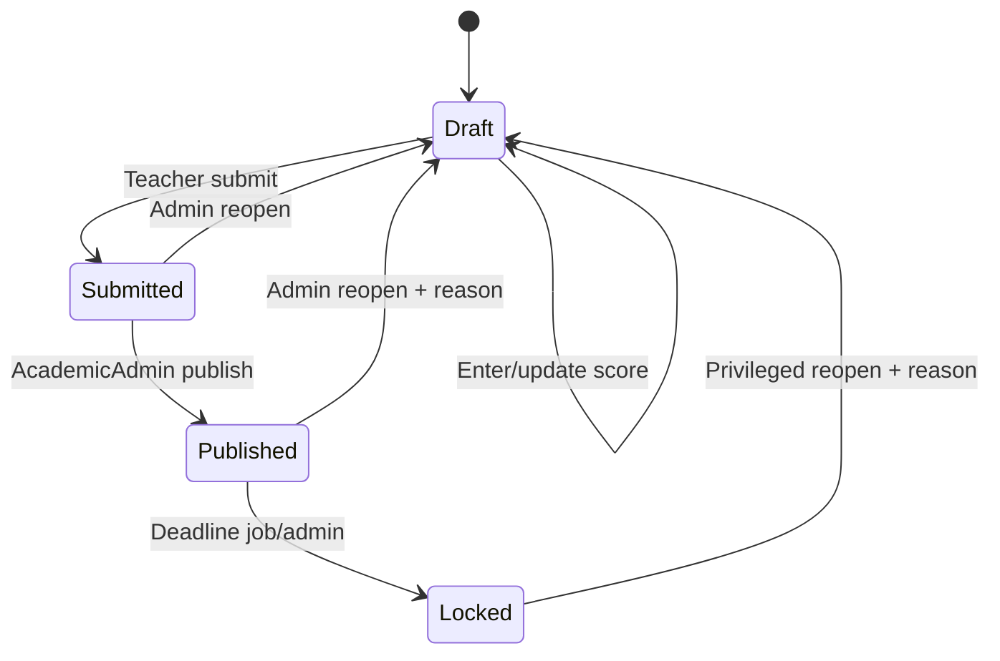

# EduHub Portal — Business Rules & Complete Test Case Catalogue

> **Mục đích:** Tài liệu này là acceptance specification cho developer/Codex và QA. Mỗi rule có mã để liên kết với validator, domain method, authorization policy và test.
>
> **Cách đọc:** `H` = happy case, `B` = bad case, `E` = edge/concurrency/resilience case. “Expected” phải được kiểm tra cả HTTP response, database state và side effects.

---

## 1. Nguyên tắc toàn hệ thống

### 1.1 Quy tắc chung

| ID | Business rule |
|---|---|
| SYS-001 | PostgreSQL là nguồn sự thật duy nhất của dữ liệu học vụ. Redis/Mongo/SignalR/email/external API không được quyết định transaction chính thành công hay thất bại. |
| SYS-002 | Mọi ID nội bộ là UUID do server tạo; mã học sinh/lớp/môn là business key unique, trim và normalize trước khi so sánh. |
| SYS-003 | Mọi timestamp lưu UTC; lịch nghiệp vụ hiển thị/chạy theo `Asia/Ho_Chi_Minh`. |
| SYS-004 | Điểm và trọng số dùng `decimal`, không dùng `double`; rounding `MidpointRounding.AwayFromZero` và chỉ round ở đầu ra/quy tắc đã xác định. |
| SYS-005 | Command thay đổi dữ liệu phải idempotent khi client/job có thể retry. |
| SYS-006 | Side effect sau commit (cache invalidation, SignalR, email, sync) phải đi qua outbox/job idempotent. |
| SYS-007 | Không hard delete dữ liệu điểm, lịch sử thay đổi, enrollment đã phát sinh hoặc audit nghiệp vụ. |
| SYS-008 | Không trả secret, stack trace, connection string hoặc thông tin nhận dạng không cần thiết trong response/log. |
| SYS-009 | Pagination mặc định 20, tối đa 100; sort field dùng allow-list; search trim và giới hạn độ dài. |
| SYS-010 | API mutation yêu cầu content type JSON, giới hạn payload và rate limit phù hợp. |

### 1.2 Chuẩn response

| Tình huống | Expected |
|---|---|
| Tạo thành công | `201 Created`, `Location`, DTO |
| Query thành công | `200 OK` |
| Update/action thành công | `200 OK` hoặc `204 No Content` theo contract |
| Background job accepted | `202 Accepted`, `jobId`, `statusUrl` |
| Validation | `400 ProblemDetails`, field errors |
| Chưa xác thực | `401` |
| Đã xác thực nhưng trái quyền/phạm vi | `403` |
| Resource không tồn tại trong phạm vi được phép biết | `404` |
| Duplicate/state/concurrency | `409` |
| Rate limit | `429`, `Retry-After` |
| Dependency đồng bộ bắt buộc đang lỗi | `503`; side effect async thì vẫn trả success nghiệp vụ chính |

Quy tắc chống dò dữ liệu: với Parent/Student truy cập tài nguyên không thuộc họ, có thể trả 404 thay vì xác nhận resource tồn tại.

---

## 2. Authentication, session và authorization

### 2.1 Rules

| ID | Rule |
|---|---|
| AUTH-001 | Email login được trim + normalize; so sánh case-insensitive. |
| AUTH-002 | Password chỉ lưu strong hash; response login sai luôn dùng thông báo chung. |
| AUTH-003 | User inactive/locked không được nhận token. |
| AUTH-004 | Access token chứa user ID, role/scopes, issuer, audience, expiry và unique token ID. |
| AUTH-005 | Refresh token chỉ lưu hash, có expiry, device/session metadata, revoke time; rotate mỗi lần dùng. |
| AUTH-006 | Reuse refresh token đã rotate/revoke làm revoke cả token family liên quan. |
| AUTH-007 | Logout revoke session hiện tại; không mặc định logout mọi device. |
| AUTH-008 | Authorization kiểm tra role + ownership/teaching assignment; client-supplied role/userId không được tin. |
| AUTH-009 | Admin thay role, disable user, reopen grade và manual sync phải audit. |
| AUTH-010 | SignalR dùng JWT và group membership do server xác lập. |

### 2.2 Cases

| ID | Scenario | Expected |
|---|---|---|
| AUTH-H01 | Active user login đúng | 200; access + refresh; refresh hash lưu DB; audit success |
| AUTH-H02 | Access hết hạn, refresh hợp lệ | 200; token pair mới; token cũ revoked |
| AUTH-H03 | Logout | 204; refresh hiện tại không dùng lại được |
| AUTH-B01 | Email sai format/password rỗng | 400; không query/verify thừa |
| AUTH-B02 | Email không tồn tại | 401 generic; không lộ user existence |
| AUTH-B03 | Password sai | 401 generic; audit/rate counter tăng |
| AUTH-B04 | User inactive | 401/403 theo contract; không phát token |
| AUTH-B05 | JWT thiếu/sai chữ ký/sai issuer/audience | 401; handler không chạy |
| AUTH-B06 | Teacher sửa lớp không được phân công | 403/404; DB không đổi; không outbox |
| AUTH-B07 | Parent xem học sinh không liên kết | 404/403; không trả cache/data |
| AUTH-B08 | Client tự gửi role Admin trong body/header | Bị bỏ qua; policy dựa trên server identity |
| AUTH-E01 | Hai refresh request đồng thời cùng token | Chỉ một thành công; request còn lại bị reuse detection |
| AUTH-E02 | Login brute force | 429 sau ngưỡng; không leak account existence |
| AUTH-E03 | Token hợp lệ nhưng user vừa bị disable | Sensitive endpoint kiểm tra security stamp/status; từ chối |

---

## 3. Student và parent relationship

### 3.1 Rules

| ID | Rule |
|---|---|
| STU-001 | `StudentCode` bắt buộc, unique sau normalize; không tái sử dụng mã của hồ sơ đã rút/học xong. |
| STU-002 | FullName bắt buộc, trim, giới hạn độ dài; DateOfBirth không ở tương lai. |
| STU-003 | Chỉ AcademicAdmin tạo/cập nhật trạng thái học sinh. |
| STU-004 | Học sinh `Graduated/Withdrawn` không được ghi danh mới, trừ quy trình phục hồi có audit. |
| STU-005 | Cập nhật dùng concurrency token/version. |
| STU-006 | Parent link unique theo cặp và có trạng thái/hiệu lực; deactivate thay vì xóa lịch sử. |
| STU-007 | Chỉ ParentStudent active cho phép đọc grade/notification. |
| STU-008 | Không deactivate liên kết duy nhất nếu chính sách nhà trường yêu cầu ít nhất một guardian; nếu chưa xác nhận chính sách thì cho phép nhưng cảnh báo/audit. |

### 3.2 Cases

| ID | Scenario | Expected |
|---|---|---|
| STU-H01 | Admin tạo student hợp lệ | 201; row + outbox; mã normalized |
| STU-H02 | Admin sửa tên với version đúng | 200; version tăng |
| STU-H03 | Gắn parent active chưa tồn tại | 201; parent truy cập được sau commit |
| STU-H04 | Deactivate parent link | 204; lịch sử còn; parent mất quyền |
| STU-B01 | Trùng StudentCode khác hoa/thường/khoảng trắng | 409; không insert |
| STU-B02 | DOB tương lai/tên rỗng/mã quá dài | 400 field errors |
| STU-B03 | Teacher tạo student | 403 |
| STU-B04 | Gắn user không có role Parent hoặc inactive | 409/400 theo error catalogue |
| STU-B05 | Gắn cùng parent lần hai | 409 hoặc idempotent 200; không duplicate |
| STU-B06 | Parent link inactive vẫn query grade | 404/403; không cache leak |
| STU-E01 | Hai admin tạo cùng code đồng thời | DB unique giữ một row; loser 409 |
| STU-E02 | Hai admin update cùng version | Một thành công; một 409 concurrency |

---

## 4. Academic year, semester và subject

### 4.1 Rules

| ID | Rule |
|---|---|
| ACA-001 | AcademicYear `StartDate < EndDate`; name unique. |
| ACA-002 | Semester nằm trọn trong AcademicYear và không overlap semester khác của cùng năm. |
| ACA-003 | Grade entry window nằm trong semester hoặc khoảng gia hạn được cấu hình. |
| ACA-004 | Không sửa ngày học kỳ theo cách làm dữ liệu grade/enrollment hiện tại trở nên bất hợp lệ; cần migration nghiệp vụ riêng. |
| ACA-005 | SubjectCode unique, Name bắt buộc, Credits > 0, MaxScore mặc định 10. |
| ACA-006 | Subject đã được dùng không hard delete; chỉ `IsActive=false`. |
| ACA-007 | Grade components unique tên/order trong subject+semester; Weight > 0 và tổng chính xác 1.00 trước khi cho nhập/submit. |
| ACA-008 | Cấu hình component đã có grade không được sửa weight/max score trực tiếp; tạo config version mới hoặc migration có audit. |

### 4.2 Cases

| ID | Scenario | Expected |
|---|---|---|
| ACA-H01 | Tạo year và semester hợp lệ | 201; FK/range đúng |
| ACA-H02 | Tạo subject credits 3 | 201 |
| ACA-H03 | Disable subject chưa/đã dùng | 200; không hiện cho assignment mới; lịch sử còn |
| ACA-B01 | Start >= End | 400 |
| ACA-B02 | Semester ngoài year/overlap | 409/400; không insert |
| ACA-B03 | SubjectCode trùng normalized | 409 |
| ACA-B04 | Credits 0/âm | 400 |
| ACA-B05 | Component weights tổng 0.9 hoặc 1.1 | Không activate config/không submit grades |
| ACA-B06 | Sửa component đã có published grade | 409; yêu cầu versioned change flow |
| ACA-E01 | Decimal weights 0.1+0.2+0.7 | Tổng decimal đúng 1.00; không lỗi floating point |

---

## 5. Class, teaching assignment và enrollment

### 5.1 Rules

| ID | Rule |
|---|---|
| CLS-001 | ClassCode unique trong AcademicYear; Capacity > 0. |
| CLS-002 | Assignment chỉ dùng active teacher, subject, class và semester liên quan. |
| CLS-003 | Một teacher–class–subject–semester assignment active không được duplicate. |
| CLS-004 | Teacher chỉ quản lý grade theo assignment active; ngừng assignment không xóa lịch sử. |
| ENR-001 | Student phải Active và chưa active enrollment trùng class/semester. |
| ENR-002 | Sĩ số active không vượt Capacity, kể cả request đồng thời. |
| ENR-003 | Student chỉ có một lớp chính active cho cùng semester/grade level nếu mô hình lớp chính; các lớp môn học phải có type riêng. |
| ENR-004 | Không rút enrollment nếu đã published grade mà không qua quy trình có lý do/audit. |
| ENR-005 | Chuyển lớp đóng enrollment cũ và tạo enrollment mới trong cùng transaction; grade transfer là quy trình explicit. |
| ENR-006 | Bulk default partial-success; kết quả từng student rõ ràng và idempotent. |

### 5.2 Cases

| ID | Scenario | Expected |
|---|---|---|
| CLS-H01 | Admin tạo lớp hợp lệ | 201 |
| CLS-H02 | Phân công teacher hợp lệ | 201; teacher có scope |
| ENR-H01 | Ghi danh student active khi còn chỗ | 201; active count tăng |
| ENR-H02 | Bulk 10 mã: 8 hợp lệ, 2 sai | 8 success, 2 error chi tiết; không mơ hồ |
| ENR-H03 | Chuyển lớp hợp lệ | Old closed + new active atomically |
| CLS-B01 | Capacity <= 0/mã trùng | 400/409 |
| CLS-B02 | Teacher inactive/subject disabled | 409; không assignment |
| CLS-B03 | Duplicate assignment | 409/idempotent result; không duplicate |
| ENR-B01 | Student inactive/graduated/withdrawn | 409 |
| ENR-B02 | Lớp đủ chỗ | 409 `ClassCapacityExceeded` |
| ENR-B03 | Enrollment trùng | 409/idempotent 200 |
| ENR-B04 | Rút student đã có published grade không reason/authority | 409/403 |
| ENR-E01 | Hai request tranh slot cuối | Chỉ một thành công; active count không vượt capacity |
| ENR-E02 | Bulk lặp cùng studentCode trong payload | Dòng duplicate bị từ chối; không tạo hai enrollment |
| ENR-E03 | Chuyển lớp fail khi tạo enrollment mới | Transaction rollback, enrollment cũ vẫn active |

---

## 6. Grade entry, history và state machine

### 6.1 State transitions



Transition ngoài sơ đồ phải bị từ chối. Republish đi Draft → Submitted → Published và tăng publication/version.

### 6.2 Rules

| ID | Rule |
|---|---|
| GRD-001 | Score bắt buộc thuộc `[0, component.MaxScore]`; thang mặc định 0–10. |
| GRD-002 | Precision score tối đa theo cấu hình (mặc định 2 chữ số thập phân); không silently truncate. |
| GRD-003 | Student phải có enrollment hợp lệ và grade component thuộc đúng assignment/subject/semester. |
| GRD-004 | Teacher phải sở hữu assignment active và grade entry window đang mở. |
| GRD-005 | Draft có thể tạo/sửa; Submitted/Published/Locked không sửa trực tiếp. |
| GRD-006 | Mọi sửa điểm existing tạo GradeChangeHistory với old/new, actor, timestamp, reason/correlation. |
| GRD-007 | Sửa Draft lần đầu có thể không cần reason; sửa sau Submitted/Published sau reopen bắt buộc reason không rỗng. |
| GRD-008 | Update bắt buộc concurrency version; stale update trả 409. |
| GRD-009 | Idempotency key cùng payload trả cùng kết quả; cùng key khác payload trả 409. |
| GRD-010 | Submit chỉ khi tất cả component bắt buộc có điểm, weight config active tổng 1.00 và không còn validation error. |
| GRD-011 | Publish chỉ AcademicAdmin, chỉ từ Submitted và phải tính được aggregate/GPA. |
| GRD-012 | Parent/Student chỉ thấy Published/Locked; không thấy Draft/Submitted qua API, cache, SignalR hoặc report. |
| GRD-013 | Reopen chỉ AcademicAdmin (Locked có thể yêu cầu elevated permission), bắt buộc lý do, audit và notification. |
| GRD-014 | Grade history append-only; không update/delete qua API. |
| GRD-015 | Bulk `atomic=true` rollback toàn bộ nếu một dòng lỗi; `atomic=false` phải trả status từng dòng. |
| GRD-016 | Empty bulk request là 400; batch vượt giới hạn là 413/400 theo contract. |
| GRD-017 | Publish/reopen/republish phải invalidate cache và phát event sau commit. |

### 6.3 Happy cases

| ID | Scenario | Expected |
|---|---|---|
| GRD-H01 | Assigned teacher nhập 8.5 cho enrolled student trong window | 200; score 8.5; history/outbox đúng; version tăng |
| GRD-H02 | Teacher sửa Draft 8.5→9.0 với version mới nhất | 200; history old/new; cache event sau commit |
| GRD-H03 | Bulk atomic tất cả hợp lệ | Một transaction; tất cả row/version cập nhật |
| GRD-H04 | Đủ component và teacher submit | Draft→Submitted; aggregate tính đúng |
| GRD-H05 | Admin publish Submitted | Published; outbox; Parent nhận notification và query thấy điểm |
| GRD-H06 | Admin reopen Published có reason | Draft; version tăng; parent được báo điểm đang điều chỉnh |
| GRD-H07 | Teacher sửa sau reopen, submit lại, admin republish | Bản mới có publication version; history nguyên vẹn |
| GRD-H08 | Lock job chạy sau deadline | Published→Locked, idempotent |

### 6.4 Validation/bad cases

| ID | Scenario | Expected |
|---|---|---|
| GRD-B01 | Score -0.01 hoặc 10.01 khi max 10 | 400; không DB/outbox |
| GRD-B02 | Score quá precision cho phép | 400, không silently round/truncate |
| GRD-B03 | Student không thuộc assignment class | 409/404 |
| GRD-B04 | Component thuộc môn/semester khác | 409 |
| GRD-B05 | Teacher đúng role nhưng assignment khác | 403/404 |
| GRD-B06 | Nhập ngoài grade window | 409 `GradeEntryWindowClosed` |
| GRD-B07 | Sửa Submitted/Published/Locked trực tiếp | 409 `InvalidGradeState` |
| GRD-B08 | Update không gửi version | 400/428 theo contract đã chọn; ưu tiên 400 ProblemDetails |
| GRD-B09 | Stale version | 409; trả current version/ETag; không overwrite |
| GRD-B10 | Submit thiếu một component bắt buộc | 409 + danh sách thiếu |
| GRD-B11 | Submit khi tổng weight != 1.00 | 409 configuration error |
| GRD-B12 | Teacher tự publish | 403 |
| GRD-B13 | Publish từ Draft/Published | 409; không event trùng |
| GRD-B14 | Reopen không reason | 400 |
| GRD-B15 | Parent gọi endpoint draft gradebook | 403/404 |
| GRD-B16 | Bulk có duplicate student | 400; atomic rollback |
| GRD-B17 | Bulk atomic: 99 hợp lệ + 1 invalid | 400; 0 row thay đổi |
| GRD-B18 | Cùng idempotency key nhưng payload khác | 409 |

### 6.5 Edge/concurrency/resilience cases

| ID | Scenario | Expected |
|---|---|---|
| GRD-E01 | Hai teacher/admin update cùng grade/version | Một commit; một 409; history không split-brain |
| GRD-E02 | Request timeout sau server commit, client retry cùng idempotency key | Trả kết quả cũ; không duplicate history/event |
| GRD-E03 | PostgreSQL fail trước commit | Không grade/history/outbox; 500/503 sanitized |
| GRD-E04 | PostgreSQL commit nhưng Redis down | Grade success; outbox retry invalidation; query fallback DB |
| GRD-E05 | PostgreSQL commit nhưng Mongo down | Grade success; sink buffer/failure metric; PostgreSQL history còn |
| GRD-E06 | Publish request gửi hai lần | Một state transition/event publication version; lần hai idempotent/409 rõ ràng |
| GRD-E07 | Reopen đồng thời với lock job | Transaction/concurrency chỉ một transition hợp lệ; trạng thái xác định |
| GRD-E08 | Score chính xác 0 và 10 | Cả hai hợp lệ |
| GRD-E09 | Decimal 8.005 | Xử lý precision/round theo policy nhất quán, có unit test |

---

## 7. GPA và classification

### 7.1 Rules

| ID | Rule |
|---|---|
| GPA-001 | `SubjectAverage = Round(Σ Score×Weight, 2, AwayFromZero)`. |
| GPA-002 | `SemesterGPA = Round(Σ SubjectAverage×Credits / Σ Credits, 2, AwayFromZero)`. |
| GPA-003 | Chỉ Published/Locked grade hợp lệ tham gia GPA chính thức. |
| GPA-004 | Môn miễn học/Pass-Fail không tham gia GPA nếu config flag loại trừ. |
| GPA-005 | Thiếu điểm bắt buộc thì GPA official là unavailable, không coi điểm thiếu = 0. |
| GPA-006 | Tổng credits divisor phải > 0; nếu không, trả `null/not available`, không divide-by-zero. |
| GPA-007 | Classification policy có version/effective date; report lưu policy version đã dùng. |

### 7.2 Cases

| ID | Scenario | Expected |
|---|---|---|
| GPA-H01 | 8×0.2 + 9×0.3 + 7×0.5 | SubjectAverage = 7.80 |
| GPA-H02 | Môn A 8.0×3 credits, B 7.0×2 | SemesterGPA = 7.60 |
| GPA-H03 | GPA 8.50 với policy mặc định | Excellent |
| GPA-B01 | Weight config thiếu/thừa | Không tính official; configuration error |
| GPA-B02 | Component bắt buộc thiếu | GPA unavailable; không tự dùng 0 |
| GPA-B03 | Credits tổng 0 | GPA unavailable; không exception divide-by-zero |
| GPA-E01 | Ngay biên 8.49/8.50, 6.99/7.00, 4.99/5.00 | Classification đúng biên |
| GPA-E02 | Policy thay đổi giữa hai học kỳ | Mỗi report dùng đúng version/effective date |

---

## 8. Redis cache và query security

### 8.1 Rules

| ID | Rule |
|---|---|
| CACHE-001 | Authorization/ownership kiểm tra trước khi trả cached DTO. |
| CACHE-002 | Key chứa resource scope + semester + view type + schema version; không dùng chung Admin draft với Parent published. |
| CACHE-003 | Cache-aside: hit trả DTO; miss query PostgreSQL rồi cache; Redis lỗi fallback DB. |
| CACHE-004 | Chỉ cache sau khi query DB thành công; không cache exception hoặc unauthorized result. |
| CACHE-005 | Publish/reopen/republish và parent-link change invalidate/version-bump liên quan. |
| CACHE-006 | TTL có jitter; chống stampede; serialization versioned. |
| CACHE-007 | Không dùng dữ liệu cache cũ để cho phép quyền đã bị thu hồi. |

### 8.2 Cases

| ID | Scenario | Expected |
|---|---|---|
| CACHE-H01 | First grade query miss | DB query, cache set, 200 |
| CACHE-H02 | Second identical authorized query hit | Không query DB; DTO giống nhau |
| CACHE-H03 | Publish grade | Key/version cũ invalidated; next query trả score mới |
| CACHE-B01 | Parent B dùng studentId của Parent A nhưng cache đã có | 404/403; cache không leak |
| CACHE-B02 | Draft cached sai view key | Test phải fail; implementation bắt buộc tách key |
| CACHE-E01 | Redis down khi query | 200 từ DB; warning metric/log, không 500 |
| CACHE-E02 | 100 cache misses đồng thời | Single-flight/lock giảm DB fan-out; kết quả nhất quán |
| CACHE-E03 | Redis chứa payload schema cũ/corrupt | Bỏ cache, query DB, overwrite; không 500 |
| CACHE-E04 | Invalidation retry đến sau query mới | Versioned key/outbox ordering không cho dữ liệu cũ sống lại |

---

## 9. SignalR và notification persistence

### 9.1 Rules

| ID | Rule |
|---|---|
| NTF-001 | Chỉ authenticated connection được vào hub. |
| NTF-002 | Server tự add `user:{userId}` group; client không chỉ định parent/student group. |
| NTF-003 | Chỉ Published/republished/reopened grade phát thông báo phụ huynh/học sinh. |
| NTF-004 | Notification phải lưu DB trước hoặc cùng cơ chế đảm bảo trước push; client offline vẫn xem được. |
| NTF-005 | Payload real-time tối thiểu; chi tiết lấy qua authorized API. |
| NTF-006 | Event consumer idempotent theo eventId/recipient; không duplicate notification. |
| NTF-007 | Mark-as-read chỉ owner. |

### 9.2 Cases

| ID | Scenario | Expected |
|---|---|---|
| NTF-H01 | Parent online, grade published | DB notification + một SignalR event đúng user |
| NTF-H02 | Parent offline | DB notification tồn tại; thấy khi query sau |
| NTF-H03 | Parent có hai con | Event chỉ chứa student liên quan; cả hai vẫn query đúng scope |
| NTF-B01 | Kết nối hub không token/token expired | Reject/disconnect |
| NTF-B02 | Client yêu cầu join `user:adminId` | Không có API/ignore; không nhận event |
| NTF-B03 | Parent mark notification người khác read | 404/403; row không đổi |
| NTF-B04 | Draft score update | Không push Parent/Student |
| NTF-E01 | Consumer xử lý event hai lần | Một notification; push duplicate được giảm/không duplicate theo dedupe |
| NTF-E02 | SignalR server down | Business commit success; notification DB còn; retry/poll fallback |

---

## 10. Hangfire: email, weekly digest, lock và PDF

### 10.1 Rules

| ID | Rule |
|---|---|
| JOB-001 | Job payload chứa ID/version, không serialize EF entity hoặc secret. |
| JOB-002 | Job phải re-load current state và kiểm tra idempotency trước khi làm side effect. |
| JOB-003 | Retry transient hữu hạn; permanent failure lưu trạng thái/admin-visible. |
| JOB-004 | Weekly digest chạy Chủ Nhật 23:00 `Asia/Ho_Chi_Minh`, xử lý DST/timezone bằng timezone ID phù hợp host. |
| JOB-005 | Daily/weekly email không gửi draft grade và không gửi duplicate cùng recipient/period/version. |
| JOB-006 | Grade lock job chỉ lock Published grade đến hạn; chạy lại không đổi kết quả. |
| RPT-001 | Request PDF authorize trước enqueue; tạo job record và trả 202. |
| RPT-002 | PDF dùng snapshot/version xác định; report ghi generatedAt/policyVersion/checksum. |
| RPT-003 | Download chỉ requester/authorized role; link có expiry; không lộ local path. |
| RPT-004 | Cùng report request idempotency key không enqueue nhiều job. |

### 10.2 Cases

| ID | Scenario | Expected |
|---|---|---|
| JOB-H01 | Có published changes trong tuần | 23:00 Sunday enqueue/send một digest |
| JOB-H02 | Lock job gặp grade Published đến hạn | Chuyển Locked, audit, idempotent |
| RPT-H01 | Parent tạo report cho con | 202; job Completed; notification; tải được trước expiry |
| RPT-H02 | Admin tạo report cả lớp lớn | Async, API không timeout; status query hoạt động |
| JOB-B01 | Email address invalid | Permanent failure recorded; không retry vô hạn |
| JOB-B02 | Digest chứa Draft grade | Test fail; implementation phải lọc Published/Locked |
| RPT-B01 | Parent request report học sinh khác | 404/403; không enqueue |
| RPT-B02 | Job ID không tồn tại/không thuộc user | 404/403 |
| RPT-B03 | Download trước completed/sau expired | 409/410 theo contract; không file leak |
| JOB-E01 | Worker crash sau gửi email trước mark success | Provider/idempotency key hoặc send record ngăn duplicate tối đa có thể |
| JOB-E02 | Scheduler chạy recurring job hai instance | Distributed lock/idempotency tạo một digest |
| RPT-E01 | PDF generation fail transient | Retry, cùng job record; không nhiều files active |
| RPT-E02 | Grade republished khi PDF đang sinh | PDF gắn snapshot/version; không trộn hai version |

---

## 11. Ministry API qua Refit + Polly

### 11.1 Rules

| ID | Rule |
|---|---|
| SYNC-001 | Chỉ sync Published/Locked grade version, không Draft/Submitted. |
| SYNC-002 | Sync async sau local commit; external failure không rollback local grade. |
| SYNC-003 | Refit interface versioned; mapping domain→external DTO tách riêng. |
| SYNC-004 | Timeout per attempt; retry tối đa 3 lần cho timeout/408/429/5xx với exponential backoff+jitter và `Retry-After`. |
| SYNC-005 | Không retry validation/auth/not-found 4xx mù quáng; classify permanent hoặc credential workflow. |
| SYNC-006 | Circuit breaker mở theo cấu hình; khi open không gọi mạng, schedule retry sau. |
| SYNC-007 | Idempotency key `aggregateId:version`; store external response/status/attempts. |
| SYNC-008 | Manual retry giữ idempotency key và audit actor/reason. |
| SYNC-009 | Payload/response log phải mask API key và PII nhạy cảm. |

### 11.2 Cases

| ID | Scenario | Expected |
|---|---|---|
| SYNC-H01 | Ministry returns 200/201 | Sync Succeeded; externalId/version lưu |
| SYNC-H02 | 500 rồi 200 | Retry và success; attempt count đúng |
| SYNC-H03 | 429 + Retry-After | Chờ theo header, không retry dồn dập |
| SYNC-B01 | 400 invalid contract | FailedPermanent/admin review; không retry 3 lần mù quáng |
| SYNC-B02 | 401/403 | Alert credential/config; không loop vô hạn |
| SYNC-B03 | Client cố sync Draft | 409/handler reject |
| SYNC-E01 | Timeout cả 3 lần | RetryScheduled/failed theo policy; local grade vẫn Published |
| SYNC-E02 | Circuit open | Không call external; job rescheduled, health degraded |
| SYNC-E03 | Cùng event/job chạy hai lần | External nhận cùng idempotency key; một SyncRecord logical |
| SYNC-E04 | Republish version 2 sau version 1 | Hai idempotent versions; ordering guard không để v1 ghi đè v2 |
| SYNC-E05 | External service khôi phục | Circuit half-open probe thành công, flow trở lại |

---

## 12. Audit/Serilog/MongoDB

### 12.1 Rules

| ID | Rule |
|---|---|
| AUD-001 | Log JSON có timestamp, level, correlationId, actor, useCase, entity/action/result/duration. |
| AUD-002 | Không log password, JWT, refresh token, API key, connection string, raw auth header. |
| AUD-003 | Request body có PII/score được allow-list hoặc redact, không dump toàn bộ mặc định. |
| AUD-004 | GradeChangeHistory PostgreSQL là audit nghiệp vụ append-only; Mongo là audit/technical observability bổ sung. |
| AUD-005 | Mongo sink fail không làm rollback business transaction. |
| AUD-006 | Correlation ID đi xuyên API, outbox, job và external call. |
| AUD-007 | Audit retention/index/permission theo môi trường; chỉ Admin được query và query cũng audit. |

### 12.2 Cases

| ID | Scenario | Expected |
|---|---|---|
| AUD-H01 | Update grade success | Mongo structured log + PostgreSQL history cùng correlation ID |
| AUD-H02 | Validation fail | Log outcome/field names an toàn; không DB write |
| AUD-B01 | Login request logged | Không có plaintext password/token |
| AUD-B02 | Exception from external API includes headers | API key/Auth header redacted |
| AUD-E01 | Mongo unavailable | Request chính vẫn theo kết quả PostgreSQL; sink error metric/buffer |
| AUD-E02 | Client gửi malicious correlation ID dài/control chars | Server validate/generate safe ID |

---

## 13. Mapster, MediatR, validation và endpoint boundaries

### 13.1 Rules

| ID | Rule |
|---|---|
| APP-001 | Carter endpoint chỉ parse/map/send/result; không DbContext/business logic. |
| APP-002 | Mapster không map client-controlled fields như Id, Role, Status, CreatedAt, Version nếu server sở hữu. |
| APP-003 | FluentValidation xử lý shape/format/range; domain/handler xử lý state/permission/cross-entity rule. |
| APP-004 | Mọi command qua validation, authorization, logging và transaction behavior phù hợp. |
| APP-005 | Query dùng projection DTO/AsNoTracking; không trả EF entity/navigation graph. |
| APP-006 | CancellationToken truyền từ HTTP tới MediatR/EF/Redis/Refit; sau commit side effect do outbox đảm nhiệm, không phụ thuộc request token. |
| APP-007 | Không catch-and-ignore; expected error dùng Result/Error, unexpected error vào middleware. |

### 13.2 Cases

| ID | Scenario | Expected |
|---|---|---|
| APP-H01 | Valid request | Endpoint map→send→HTTP result, handler được gọi một lần |
| APP-B01 | Body cố set `Status=Published`, `Role=Admin` | Map ignore; server state không bị mass assignment |
| APP-B02 | Validation fail | Handler/DbContext không được gọi |
| APP-B03 | Query returns entity with password hash | Contract/architecture test fail; DTO bắt buộc |
| APP-E01 | Client disconnect trước commit | Cancellation rollback; không partial write |
| APP-E02 | Client disconnect sau commit | Outbox vẫn xử lý side effects |

---

## 14. Security và privacy cases bắt buộc

| ID | Scenario | Expected |
|---|---|---|
| SEC-001 | SQL injection string trong search/code | Parameterized EF query; không SQL execution |
| SEC-002 | XSS HTML/script trong name/reason | Validate/encode ở output/template; không execute trong UI/email |
| SEC-003 | Mass assignment status/role/owner/version | Ignored/rejected |
| SEC-004 | IDOR Parent đổi studentId trên URL | 404/403; no data/cache leak |
| SEC-005 | Teacher đổi assignmentId | Resource authorization reject |
| SEC-006 | Oversized bulk/report request | 413/rate limit trước memory exhaustion |
| SEC-007 | Malformed JSON/unsupported content type | 400/415 ProblemDetails |
| SEC-008 | Replay mutation với same idempotency key | Same result; no duplicate side effect |
| SEC-009 | Different payload same idempotency key | 409 |
| SEC-010 | Swagger/Hangfire dashboard production anonymous | Must be denied; auth/admin/network restriction |
| SEC-011 | Download URL shared after expiry | 410/403; no file |
| SEC-012 | Log injection/newline/control chars | Structured property safe; no forged log entry |

---

## 15. Database transaction/integrity cases

| ID | Scenario | Expected |
|---|---|---|
| DB-001 | Grade update + history succeeds, outbox insert fails | Entire transaction rollback |
| DB-002 | Grade update succeeds in memory, SaveChanges fails | No side effects; response error |
| DB-003 | Outbox processed then worker crashes before mark | Redelivery idempotent; no logical duplicate |
| DB-004 | Unique constraint race student/enrollment/grade | One winner; loser mapped to 409, not raw DB error |
| DB-005 | FK target deleted/disabled concurrently | Transaction rejects/handler returns conflict |
| DB-006 | Soft-deleted subject/class queried by normal list | Excluded; historical grade projection still resolves snapshot/name |
| DB-007 | Migration applied twice | Idempotent deployment state; no data loss |
| DB-008 | Seed run twice | No duplicate roles/admin/demo master data |

---

## 16. OpenAPI, Postman và contract acceptance

Mọi endpoint phải có:

- summary/description/tags;
- auth requirement;
- request/response schema và example;
- tất cả status codes thực tế;
- `ProblemDetails` examples;
- pagination/filter/sort docs;
- `Idempotency-Key` và `If-Match`/version ở mutation nhạy cảm;
- `Correlation-Id` response header;
- Postman happy + bad tests cho auth, grade update, publish, query cache, report job.

Contract cases:

| ID | Scenario | Expected |
|---|---|---|
| API-001 | Unknown route | 404 ProblemDetails/consistent response |
| API-002 | Unsupported method | 405 |
| API-003 | Invalid UUID route value | 400, không 500 |
| API-004 | Page size > max | 400 hoặc clamp được document; ưu tiên 400 |
| API-005 | Unknown sort field | 400 allow-list |
| API-006 | New optional response field | Backward compatible within v1 |
| API-007 | Breaking contract | New API/payload version, không âm thầm đổi v1 |

---

## 17. Test suite map cho xUnit

### 17.1 Unit tests

```text
Domain/Grades/GradeEntryTests
  - CreateScore_Boundaries
  - UpdateScore_RecordsHistory
  - UpdateScore_InvalidState
  - Submit_MissingComponents
  - Publish_InvalidTransition
  - Reopen_RequiresReason

Domain/Grades/GpaCalculatorTests
  - WeightedAverage
  - CreditWeightedSemesterGpa
  - DecimalRoundingBoundaries
  - MissingRequiredComponent
  - ZeroCredits
  - ClassificationThresholds

Application/Validators/*ValidatorTests
Application/Authorization/*ScopeTests
Infrastructure/Cache/CacheKeyTests
Infrastructure/Integrations/RetryClassificationTests
```

### 17.2 Integration tests

```text
Api/Auth/*
Api/Students/Create_Update_ParentAccess
Api/Academics/Year_Semester_Subject_Class
Api/Enrollments/Capacity_Concurrency_Bulk
Api/Grades/Update_Bulk_Submit_Publish_Reopen
Api/Grades/OptimisticConcurrency_Idempotency
Api/Grades/ParentVisibility
Infrastructure/Postgres/Constraints_Transaction_Outbox
Infrastructure/Redis/CacheAside_Invalidation_Fallback
Infrastructure/Hangfire/Enqueue_Idempotency
Infrastructure/SignalR/AuthorizedDelivery
Infrastructure/Refit/Contract_Polly_CircuitBreaker
Infrastructure/Serilog/Redaction_MongoFailureIsolation
```

### 17.3 Test data builders

Dùng builders/fixtures rõ ràng: `UserBuilder`, `StudentBuilder`, `AcademicPeriodBuilder`, `ClassAssignmentBuilder`, `EnrollmentBuilder`, `GradeBookBuilder`. Mỗi test tự nêu dữ liệu quan trọng; tránh shared mutable seed làm test phụ thuộc thứ tự.

---

## 18. Ma trận traceability: yêu cầu → rule → code → test

| Requirement | Rules | Expected implementation | Tests |
|---|---|---|---|
| Teacher sửa điểm 0–10 | GRD-001..009 | UpdateGrade slice + validator/domain/history/outbox | GRD-H01/H02, GRD-B01..09, GRD-E01..05 |
| CQRS/MediatR pipeline | APP-001..007 | behaviors + command/query handlers | APP-* + architecture tests |
| PostgreSQL | SYS/DB rules | EF Core configs, transaction, constraints, outbox | DB-* integration |
| Redis | CACHE-* | cache-aside/version keys/fallback | CACHE-* |
| Mongo/Serilog | AUD-* | JSON sink, enrichers, redaction | AUD-* |
| SignalR | NTF-* | authenticated hub + persistent notification | NTF-* |
| Hangfire | JOB/RPT-* | recurring/enqueued idempotent jobs | JOB/RPT-* |
| Refit/Polly | SYNC-* | typed client + resilience pipeline | SYNC-* contract tests |
| GPA/xUnit | GPA-* | decimal policy service | GPA-* unit tests |
| Swagger/Postman | API-* | OpenAPI metadata/collection | contract smoke tests |

---

## 19. Error catalogue đề xuất

Codex nên dùng stable error code thay vì phụ thuộc message:

```text
validation.failed
auth.invalid_credentials
auth.session_revoked
authorization.forbidden
student.not_found
student.code_conflict
academic.invalid_period
class.capacity_exceeded
enrollment.duplicate
grade.out_of_range
grade.entry_window_closed
grade.invalid_state
grade.missing_components
grade.configuration_invalid
grade.concurrency_conflict
idempotency.key_reused_with_different_payload
report.not_ready
report.expired
sync.failed_permanently
dependency.unavailable
```

Message có thể bản địa hóa; code và HTTP status giữ ổn định.

---

## 20. Các giả định cần xác nhận sau nhưng không được chặn code nền

Những điểm này nên đặt trong configuration/policy, không hard-code:

1. Ngưỡng xếp loại chính thức (mặc định tạm: 8.5/7.0/5.0).
2. Số chữ số thập phân điểm (mặc định 2).
3. Thời hạn nhập/chốt/lock điểm cụ thể.
4. Parent có bắt buộc ít nhất một guardian active hay không.
5. Bulk enrollment là partial-success mặc định; bulk grade là atomic mặc định.
6. Storage provider thật cho PDF và email provider thật.
7. Ministry API contract, auth scheme, rate limits và sandbox URL thật.
8. Data retention cho Mongo audit, notifications và generated reports.

Codex phải tạo `Options` có validation startup cho các mục cấu hình này và dùng mock/fake adapter ở development/test.

---

## 21. Release acceptance checklist

Chỉ coi feature hoàn tất khi:

- [ ] Tất cả rule liên quan có implementation point và test ID.
- [ ] Happy, bad, permission, not-found, conflict, concurrency và dependency-failure đã test.
- [ ] Side effect chỉ xảy ra sau commit và có idempotency.
- [ ] Parent/Student không bao giờ thấy Draft/Submitted.
- [ ] Redis/Mongo/SignalR/Ministry outage không làm mất grade đã commit.
- [ ] Grade history đầy đủ old/new/actor/reason/time/version.
- [ ] Swagger/Postman phản ánh đúng contract.
- [ ] Log không chứa secret/PII không cần thiết.
- [ ] Docker Compose mặc định kết nối được Neon, Redis local và MongoDB Atlas; profile `local-databases` dựng được PostgreSQL/MongoDB local khi cần.
- [ ] Unit/integration/contract/architecture tests chạy xanh.
- [ ] Không còn TODO nghiệp vụ bị hard-code; các giả định chưa xác nhận nằm trong versioned configuration.

---

## 22. Business rules cập nhật 2026-07-14

### 22.1 Single-school và people

| ID | Rule |
|---|---|
| `BR-SCHOOL-01` | Mọi dữ liệu thuộc một trường cấu hình; UI luôn hiển thị school context. |
| `BR-PEOPLE-01` | Chỉ SystemAdmin được tạo/sửa/khóa account hoặc đổi role. |
| `BR-PEOPLE-02` | AcademicAdmin được đọc Teacher/Parent để phân công và liên kết, không quản lý credential. |
| `BR-STUDENT-01` | Một Student profile chỉ gắn tối đa một active Student account. |
| `BR-PARENT-01` | Parent chỉ thấy child qua active `ParentStudent` link. |
| `BR-PARENT-02` | Detail Student phải trả class hiện tại, lịch sử enrollment, guardians và account context. |

### 22.2 Search

| ID | Case | Expected |
|---|---|---|
| `TC-SEARCH-01` | Search `an` có Nguyễn Văn An và Nguyễn Minh An | Trả cả hai; không exact-match sai. |
| `TC-SEARCH-02` | Search `nguyen` với dữ liệu `Nguyễn` | Match qua normalized name. |
| `TC-SEARCH-03` | Gõ nhanh nhiều ký tự | Frontend debounce 300ms; request cũ không thay kết quả query key mới. |
| `TC-SEARCH-04` | Lọc class + status + search | Backend áp dụng đồng thời, pagination đúng total. |
| `TC-SEARCH-05` | Search tên guardian hoặc class | Trả Student có quan hệ tương ứng. |
| `TC-SEARCH-06` | Dữ liệu tên legacy là `AN`, `An` hoặc `an`; search `a` | Trả cùng kết quả, không phụ thuộc casing. |

### 22.2.1 Current class và class filter

| ID | Rule/Case | Expected |
|---|---|---|
| `BR-CLASS-UI-01` | Bộ lọc lớp hiển thị lớp active theo hai cấp. | Chọn `Khối 10` rồi chọn lớp cụ thể như `10A1`. |
| `BR-CLASS-UI-02` | Mỗi lựa chọn lớp hiển thị sĩ số/sức chứa. | Người dùng phân biệt được lớp khả dụng trước khi lọc. |
| `TC-CLASS-UI-01` | Chọn `10A1`. | Request students có đúng `classRoomId`; bảng chỉ trả enrollment active thuộc lớp. |
| `TC-CLASS-UI-02` | Chọn “Tất cả lớp”. | Bỏ `classRoomId`, giữ nguyên search/status hiện tại. |
| `TC-CLASS-UI-03` | Học sinh không có enrollment active. | `currentClassId/code/name = null`; UI hiển thị “Chưa xếp lớp”. |

### 22.3 Teacher gradebook

| ID | Rule/Case | Expected |
|---|---|---|
| `BR-GRADEBOOK-01` | Teacher chỉ đọc/sửa assignment được phân công. | Assignment khác -> Forbidden. |
| `BR-GRADEBOOK-02` | Editor dùng một bounded read model. | Không N+1 từ frontend. |
| `BR-GRADEBOOK-03` | Teacher sửa Draft/Reopened; Submitted/Published/Locked read-only. | Mutation sai state -> Conflict. |
| `BR-GRADEBOOK-04` | Score nằm trong `0..component.MaxScore`. | Ngoài range -> Validation error. |
| `BR-GRADEBOOK-05` | Bulk atomic có một row sai. | Toàn bộ request rollback. |
| `BR-REMARK-01` | Remark thuộc Assignment + Student + Teacher, có optimistic version. | Stale version -> Conflict. |
| `BR-REMARK-02` | Remark chỉ hiển thị Parent khi gradebook Published/Locked. | Draft/Submitted hidden. |
| `TC-GRADEBOOK-01` | Assignment chưa có grade entry | Trả roster + components + null score, state Draft. |
| `TC-GRADEBOOK-02` | Thiếu required score khi submit | Submit bị từ chối với component/student cụ thể. |
| `TC-GRADEBOOK-03` | Admin publish Submitted | Grade + remark được công bố, notification tạo sau commit. |
| `TC-GRADEBOOK-04` | Admin reopen Published/Locked có reason | Teacher được chỉnh sửa; audit giữ reason. |

### 22.4 Parent grade visibility

| ID | Case | Expected |
|---|---|---|
| `TC-PARENT-01` | Parent không có child link | `/me/children` trả empty; không rò dữ liệu. |
| `TC-PARENT-02` | Parent có nhiều con | Mỗi child hiển thị name, code, relationship, current class, semester. |
| `TC-PARENT-03` | Parent gọi grade của học sinh khác | Forbidden/NotFound theo anti-enumeration policy. |
| `TC-PARENT-04` | Grade Draft hoặc Submitted | Không xuất hiện ở published endpoint. |
| `TC-PARENT-05` | Grade Published | Response có student, class, subject, semester, teacher, publish time, weight, max score, remark. |
| `TC-PARENT-06` | Hai học sinh trùng/gần tên | UI dùng StudentId và context lớp; không gộp kết quả. |

### 22.5 Report approval workflow

| ID | Rule/Case | Expected |
|---|---|---|
| `BR-REPORT-01` | Parent tạo `ReportRequest`; không tạo `ReportJob` trực tiếp. | Status `Pending`. |
| `BR-REPORT-02` | AcademicAdmin/SystemAdmin duyệt hoặc từ chối. | Reviewer/time/note được lưu. |
| `BR-REPORT-03` | Reject bắt buộc reason. | Empty reason -> Validation error. |
| `BR-REPORT-04` | Approve tạo một ReportJob và enqueue Hangfire sau persistence. | Request `Generating`; job `Queued`. |
| `BR-REPORT-05` | PDF chỉ chứa grade của semester yêu cầu. | Không lẫn grade học kỳ khác. |
| `BR-REPORT-06` | Parent chỉ tải report của child thuộc mình. | Cross-parent download bị chặn. |
| `BR-REPORT-07` | Student phải có enrollment và grade Published/Locked trong semester. | Semester sai hoặc chưa có điểm -> từ chối tạo request. |
| `TC-REPORT-01` | Parent chọn child không thuộc tài khoản | Forbidden. |
| `TC-REPORT-02` | Duplicate active request cùng child-semester | Conflict. |
| `TC-REPORT-03` | Admin reject có reason | Parent nhận notification từ chối. |
| `TC-REPORT-04` | Admin approve | Hangfire tạo PDF; completed notification gửi Parent. |
| `TC-REPORT-05` | PDF generator fail | Job và request Failed; failure notification; không trả PDF rỗng. |
| `TC-REPORT-06` | Report hết hạn | Download bị từ chối. |
| `TC-REPORT-07` | Parent refresh inbox khi job chạy | Polling chỉ khi Queued/Processing; dừng khi terminal state. |
| `TC-REPORT-08` | PDF có đủ Published/Locked grade và weight hợp lệ | Hiển thị trung bình môn, GPA học kỳ, xếp loại và policy version. |

### 22.6 Role acceptance matrix

| Capability | SystemAdmin | AcademicAdmin | Teacher | Parent |
|---|---:|---:|---:|---:|
| Account/role mutation | Yes | No | No | No |
| Student/guardian academic link | Oversight | Yes | No | No |
| Class/enrollment/assignment | Oversight | Yes | Scoped read | No |
| Draft grade/remark mutation | No | No | Assigned only | No |
| Publish/reopen/lock gradebook | Oversight | Yes | No | No |
| Create report request | No | No | No | Own child only |
| Review report request | Oversight | Yes | No | No |
| Download completed report | Authorized scope | Authorized scope | No | Own child only |

- `BR-ROLE-UI-01`: SystemAdmin portal chỉ hiện tài khoản/phân quyền, thông tin trường, sức khỏe hệ thống và thông báo; không hiện navigation/metric/shortcut học vụ và bị `RoleGate` chặn khi mở trực tiếp `/academic/*` hoặc inbox duyệt báo cáo.
- AcademicAdmin tiếp tục là workspace vận hành học sinh, lớp, ghi danh và điểm.

### 22.7 Deferred/non-scope

- LMS assignment content, student submission, rubric, online marking: **removed from scope**.
- Postman collection: deferred theo quyết định người dùng; Swagger/manual UI là bề mặt test trước.
- Student self-grade aggregate endpoint: chưa thay API Parent; cần contract riêng nếu mở rộng role Student.
- Class roster active read model cho transfer/withdraw UI: cần bổ sung trước khi bỏ feature gate cuối.

## 23. Security và consistency acceptance

| ID | Rule |
|---|---|
| `SEC-001` | UI không hiển thị UUID tài khoản nếu người dùng không cần dùng identifier đó. |
| `SEC-002` | Logout bằng refresh token phải revoke server-side kể cả access token hết hạn; request lặp lại vẫn thành công. |
| `SEC-003` | Public liveness không trả dependency details; readiness chi tiết chỉ SystemAdmin được đọc. |
| `SEC-004` | Diagnostics/cache metrics chỉ SystemAdmin được gọi. |
| `SEC-005` | Local Docker port chỉ bind loopback; Redis yêu cầu password. |
| `SEC-006` | Password hash mới dùng PBKDF2-SHA512 220,000 iterations; hash policy cũ được rehash sau login thành công. |
| `SEC-007` | Security/role/status mutation làm mới `SecurityStamp` và revoke refresh token active; sửa display profile không ép logout. |
| `SEC-008` | Development seed mặc định tắt; khi bật phải nhận password tối thiểu 12 ký tự từ secret configuration, không dùng password trong source. |
| `CONS-001` | ReportJob và `ReportJobRequested` outbox phải commit cùng transaction trước khi Hangfire enqueue. |
| `CONS-002` | Outbox worker dùng row lock + `SKIP LOCKED` để chống multi-instance claim trùng. |
| `CONS-003` | Email chỉ `Sent` sau SMTP success; lỗi phải lưu `Failed`, attempts và cho phép retry. |
| `CONS-004` | Grade cache invalidation chạy từ outbox sau PostgreSQL commit. |
| `CONS-005` | Một parent chỉ có một report request mở cho cùng student-semester. |

| ID | Case | Expected |
|---|---|---|
| `TC-SEC-01` | Logout không có/đã hết access token nhưng refresh token hợp lệ | Refresh token bị revoke; cookie bị xóa; refresh tiếp theo thất bại. |
| `TC-SEC-02` | Anonymous gọi `/health/ready` hoặc `/api/v1/pipeline/cache` | `401`; không lộ dependency/error/counter. |
| `TC-SEC-03` | Anonymous gọi `/health/live` | Chỉ nhận `{status}`. |
| `TC-SEC-04` | SystemAdmin tự demote/deactivate | `409 People.SelfAdminChangeForbidden`. |
| `TC-SEC-05` | Demote admin active cuối cùng | `409 People.LastSystemAdmin`. |
| `TC-SEC-06` | Đổi role Teacher còn assignment active | `409 People.ActiveRoleDependencies`. |
| `TC-CONS-01` | Cùng idempotency key, khác student/semester | `409 Report.IdempotencyPayloadMismatch`. |
| `TC-CONS-02` | SMTP throw sau khi delivery được tạo | Delivery `Failed`; `SentAtUtc=null`; retry gửi lại. |
| `TC-CONS-03` | Hai outbox worker chạy đồng thời | Mỗi outbox row chỉ một worker claim trong batch. |
| `TC-CONS-04` | Teacher nhập điểm ngoài grade-entry window | `409 Grade.EntryWindowClosed`; DB không đổi. |
| `TC-CONS-05` | Hai request sửa cùng row version | Request thua trả `409 database.concurrency_conflict`. |

### 23.1 Release blockers còn cần môi trường ngoài code

- Rotate Neon/Mongo Atlas/Gmail/Ministry/JWT secrets đã từng chia sẻ.
- TLS/domain/reverse proxy; trusted forwarded headers; production secret manager.
- Backup/restore rehearsal, monitoring/alerting, data retention và incident runbook.
- Ministry sandbox URL/auth/contract thật và SMTP end-to-end verification.

## 24. Curriculum, timetable, profile correction và import

### 24.1 Curriculum và teacher capability rules

| ID | Rule |
|---|---|
| `CURR-001` | Mỗi chương trình khối có 35 tuần: HK I 18 tuần, HK II 17 tuần. |
| `CURR-002` | `AnnualPeriods = Semester1Periods + Semester2Periods`; quota phải dương và không trùng môn trong cùng plan. |
| `CURR-003` | Môn được phân loại `Required`, `Elective`, `LearningTopic`; có thể ưu tiên sáng/chiều. |
| `CURR-004` | Một giáo viên có tối đa một môn chính và hai môn phụ active. |
| `CURR-005` | Auto-assignment không vượt `MaxPeriodsPerWeek`, ưu tiên môn chính rồi giáo viên ít tải. |
| `CURR-006` | Mỗi lớp-môn-học kỳ chỉ có một teaching assignment active; giáo viên phải có capability đúng môn và không phải GVCN của lớp. |
| `HOME-001` | Một lớp có một GVCN active; một giáo viên có tối đa một lớp chủ nhiệm active. |
| `HOME-002` | GVCN không được dạy môn bộ môn trong chính lớp mình chủ nhiệm; chỉ phụ trách hoạt động `HOMEROOM` tiết 5 Thứ Bảy. |
| `HOME-003` | AcademicAdmin được đổi GVCN; assignment cũ bị deactivate và giữ lịch sử, assignment mới trở thành active. |

### 24.2 Timetable rules

| ID | Rule |
|---|---|
| `TT-001` | Lịch dùng tuần thực tế 1..N của học kỳ, có ngày bắt đầu-kết thúc và phiên bản `Draft -> Published -> Archived`. |
| `TT-002` | Lịch sáng đủ 29 tiết/tuần; Thứ Tư 4 tiết sáng; Thứ Bảy không học chiều và tiết 5 là sinh hoạt lớp. |
| `TT-003` | Một lớp và một giáo viên không có hai tiết trùng slot. |
| `TT-004` | Cùng môn tối đa hai tiết/ngày; hai tiết phải liền nhau; không có ba tiết cùng môn trong ngày. |
| `TT-005` | Solver giới hạn giáo viên tối đa 5 tiết/ngày và cân bằng bằng tải dạy/soft penalty. |
| `TT-006` | AcademicAdmin chỉ được hoán đổi hai slot của bản Draft; không tạo slot trống và slot Locked không được đổi. |
| `TT-007` | Student/Parent/Teacher chỉ đọc Published timetable thuộc resource scope của mình. |
| `TT-008` | Publish bản mới archive bản Published cũ trong cùng học kỳ. |
| `TT-009` | Sáng bắt đầu 07:15, chiều 13:15; mỗi tiết 45 phút và chuyển tiết 5 phút. |
| `TT-010` | Nếu mở lịch chiều Thứ Hai-Thứ Sáu thì cả buổi phải đủ 5 tiết; tổng tải tuần hợp lệ là 29 cộng bội số của 5, tối đa 54. |
| `TT-011` | Đổi giáo viên thủ công áp dụng cho toàn bộ lớp-môn-học kỳ, giữ assignment ID/sổ điểm; giáo viên mới phải có capability, không phải GVCN lớp, không trùng slot, không quá 5 tiết/ngày và không vượt tải tuần. |
| `TT-012` | `period_number` được đánh số riêng trong từng buổi và luôn thuộc `1..5`; Domain validation và PostgreSQL check constraint cùng bảo vệ invariant. |

| ID | Case | Expected |
|---|---|---|
| `TC-TT-01` | Sinh lịch đủ plan/capability/class | Draft version và entry của toàn bộ tuần học kỳ được lưu, không conflict. |
| `TC-TT-02` | Thiếu giáo viên phù hợp hoặc model infeasible | Conflict; không lưu lịch nửa chừng. |
| `TC-TT-03` | Chuyển tiết vào slot lớp/giáo viên đã dùng | Conflict; entry cũ giữ nguyên. |
| `TC-TT-04` | Xếp cùng môn kiểu Toán-Văn-Toán trong một ngày | Bị từ chối vì hai tiết cùng môn không liền nhau. |
| `TC-TT-05` | Parent xem lớp không thuộc con active | Forbidden/NotFound; không lộ entry. |
| `TC-TT-06` | Teacher xem lớp không được phân công | Forbidden/NotFound. |
| `TC-TT-07` | Publish Draft khi mọi slot hợp lệ | Published; role liên quan đọc được. |
| `TC-TT-08` | Hoán đổi hai tiết hợp lệ trong bản Draft | Hai entry đổi slot; lớp vẫn đủ tiết và không sinh conflict. |
| `TC-TT-09` | Đổi sang giáo viên không có capability hoặc đã bận | Conflict; giáo viên cũ được giữ nguyên. |
| `TC-TT-10` | Dữ liệu chiều legacy dùng tiết 6/7 | Migration chuẩn hóa thành tiết 1/2; API đọc lịch không trả 500. |
| `TC-TT-10` | Tuần hiện tại nằm trong học kỳ | API weeks đánh dấu đúng tuần và trả đúng khoảng Thứ Hai-Thứ Bảy. |

### 24.3 Student profile correction rules

| ID | Rule |
|---|---|
| `PROFILE-001` | Student chỉ đọc và gửi yêu cầu cho hồ sơ gắn với tài khoản hiện tại; không nhận `StudentId` từ client. |
| `PROFILE-002` | Chỉ một request `Pending` cho mỗi học sinh để chống spam. |
| `PROFILE-003` | Evidence chỉ JPEG/PNG/WEBP, tối đa 5 MB và object key phải thuộc user hiện tại. |
| `PROFILE-004` | Evidence bucket là private; URL upload/read có thời hạn. Local fallback phải kiểm tra JWT, ownership và path traversal. |
| `PROFILE-005` | Approve cập nhật đồng thời `Student` và linked `User`; Reject không đổi hồ sơ và bắt buộc lý do. |

| ID | Case | Expected |
|---|---|---|
| `TC-PROFILE-01` | Student gửi thay đổi hợp lệ sau khi upload ảnh | Request Pending; hồ sơ chính thức chưa đổi. |
| `TC-PROFILE-02` | Student gửi request thứ hai khi còn Pending | Conflict. |
| `TC-PROFILE-03` | Upload sai MIME, extension hoặc quá 5 MB | Validation; file/request không được lưu. |
| `TC-PROFILE-04` | AcademicAdmin approve | Student/User profile cập nhật; reviewer/time được lưu. |
| `TC-PROFILE-05` | AcademicAdmin reject không note | Validation; request vẫn Pending. |

### 24.4 Excel import rules

| ID | Rule |
|---|---|
| `IMPORT-001` | Chỉ AcademicAdmin/SystemAdmin import; multipart XLSX tối đa 10 MB. |
| `IMPORT-002` | Workbook bắt buộc đúng 12 header đã công bố; ngày nhận `dd/MM/yyyy`, `yyyy-MM-dd` hoặc Excel date. |
| `IMPORT-003` | Mỗi dòng tạo/cập nhật đúng student, account, parent link và enrollment theo business key; không liên kết nhầm do trùng tên. |
| `IMPORT-004` | Lỗi một dòng được trả theo row number và không làm mất kết quả dòng hợp lệ khác. |
| `IMPORT-005` | Mật khẩu tạm của tài khoản mới chỉ trả trong response lần import, không lưu plaintext. |

| ID | Case | Expected |
|---|---|---|
| `TC-IMPORT-01` | Workbook hai dòng hợp lệ | Hai student, accounts, parent links và enrollments tồn tại đúng lớp/HK. |
| `TC-IMPORT-02` | Thiếu header | Toàn workbook bị từ chối với danh sách cột thiếu. |
| `TC-IMPORT-03` | Một dòng sai lớp, một dòng hợp lệ | Kết quả 1 lỗi/1 thành công; không rollback dòng hợp lệ. |
| `TC-IMPORT-04` | ParentEmail đã tồn tại | Tái sử dụng Parent account phù hợp, không tạo duplicate. |
## Development data lifecycle

- API startup không được tự tạo hoặc thay đổi dữ liệu nghiệp vụ.
- Migration chỉ thay đổi schema/version; không đồng nghĩa với seed dữ liệu demo.
- Seeder development chạy chủ động, idempotent và không xóa dữ liệu hiện hữu.
- Scenario seed phải có dữ liệu đại diện cho mọi trạng thái chính: Grade Draft/Submitted/Published/Locked, Profile Pending/Approved/Rejected và Report Pending/Approved/Rejected.
- Điểm scenario seed phải biến thiên theo học sinh, môn, thành phần và lớp; không được tạo cùng average/pass-rate giả tạo cho mọi lớp.
- Học sinh demo phải có enrollment ở cả HK1/HK2 để semester mặc định trên dashboard không trả số lượng bằng 0.
- TKB demo Published phải có đủ 29 tiết tuần 1 cho mỗi lớp; thứ Tư 4 tiết và thứ Bảy tiết 5 là Sinh hoạt lớp.
- Reset dữ liệu local phải là thao tác rõ ràng bằng `docker compose down -v`.
- Tài khoản, email và mật khẩu seed chỉ dùng trong môi trường local Development.

## DevExpress analytics/reporting rules

| ID | Rule |
|---|---|
| `DX-001` | Chỉ `SystemAdmin` được gọi Dashboard và Report Viewer DevExpress. |
| `DX-002` | Dashboard chạy Restricted/Viewer mode; client không được tạo, sửa hoặc thay data source. |
| `DX-003` | Dataset phải qua Application Service/Repository; DevExpress controller không đọc DbContext trực tiếp. |
| `DX-004` | Private license key không được commit, log hoặc đóng gói vào final Docker image. |
| `DX-005` | Analytics API chỉ cho `SystemAdmin`; endpoint policy và service cùng kiểm tra role. |
| `DX-006` | Không truyền học kỳ thì chọn học kỳ `Active`, nếu không có thì chọn học kỳ gần nhất. |
| `DX-007` | Điểm analytics chỉ dùng `Published`/`Locked`, chuẩn hóa về thang 10; đạt khi `>= 5`. |
| `DX-008` | Data Quality chỉ đọc và đếm lỗi; không tự động sửa dữ liệu học vụ. |
| `DX-009` | Monitoring trả Redis/Hangfire/Outbox/integration/email/report metrics nhưng không lộ connection string hoặc secret. |
| `DX-010` | XtraReport Viewer và export chỉ dùng dataset đã authorize; format export giới hạn `pdf`, `xlsx`, `csv`. |
| `DX-011` | Viewer request qua Portal BFF phải có Bearer token; refresh token không được đưa vào JavaScript. |
| `DX-012` | Weekly analytics digest chỉ gửi SystemAdmin active và dùng `EmailDigestDelivery` idempotency key theo recipient/period/template. |
| `DX-013` | PDF System Analytics phải dùng A4 Portrait và mọi control nằm trong printable width; không tạo trang chỉ chứa phần tràn ngang. |
| `DX-014` | Catalog chỉ nhận `executive-summary`, `academic-by-grade`, `data-quality`; hai report chi tiết phải group bằng `GroupHeaderBand` theo GradeLevel hoặc Severity. |
| `DX-015` | Dashboard và report Data Quality chỉ liệt kê issue có `Count > 0`; issue bằng 0 không phải công việc cần xử lý. |

## Account administration security rules

| ID | Rule |
|---|---|
| `ACCOUNT-001` | Mọi lần cập nhật tài khoản phải có lý do từ 10 đến 500 ký tự. |
| `ACCOUNT-002` | Không cho SystemAdmin tự hạ quyền hoặc tự khóa tài khoản. |
| `ACCOUNT-003` | Không cho hạ quyền/khóa SystemAdmin active cuối cùng. |
| `ACCOUNT-004` | Không đổi role/khóa tài khoản còn assignment hoặc relation nghiệp vụ active. |
| `ACCOUNT-005` | Đổi role/trạng thái phải rotate SecurityStamp và revoke toàn bộ refresh token active. |
| `ACCOUNT-006` | Audit log phải ghi actor, target, before/after và reason nhưng không ghi secret. |

| ID | Case | Expected |
|---|---|---|
| `TC-ACCOUNT-01` | Update không có lý do hoặc lý do dưới 10 ký tự | `400 Validation`; tài khoản không thay đổi. |
| `TC-ACCOUNT-02` | SystemAdmin tự hạ quyền | `409 People.SelfAdminChangeForbidden`. |
| `TC-ACCOUNT-03` | Đổi role một tài khoản hợp lệ | Thành công; refresh token cũ bị thu hồi và audit log có before/after. |

| ID | Case | Expected |
|---|---|---|
| `TC-DX-01` | Anonymous/role khác gọi DevExpress endpoint | `401/403`; không trả dashboard/report data. |
| `TC-DX-02` | SystemAdmin yêu cầu sửa dashboard từ browser | Restricted controller từ chối. |
| `TC-DX-03` | Build thiếu hoặc sai private license | Build fail bằng DevExpress license error. |
| `TC-DX-04` | SystemAdmin gọi overview không có `semesterId` | `200`; trả học kỳ active/gần nhất và danh sách học kỳ khả dụng. |
| `TC-DX-05` | Gọi analytics với `semesterId` không tồn tại | `404 Analytics.SemesterNotFound`. |
| `TC-DX-06` | Có điểm Draft/Submitted/Published/Locked | Average/pass rate chỉ tính Published và Locked; status chart vẫn đếm đủ. |
| `TC-DX-07` | Học sinh active thiếu enrollment hoặc parent link | Data Quality trả đúng issue code và count, không sửa dữ liệu. |
| `TC-DX-08` | SystemAdmin gọi `/api/v1/admin/monitoring` | Trả cache, Hangfire, Outbox và ba queue status collections. |
| `TC-DX-09` | Export `format=pdf` | `200 application/pdf`, nội dung bắt đầu `%PDF`. |
| `TC-DX-10` | Export format ngoài allow-list | `400 AnalyticsReport.UnsupportedFormat`. |
| `TC-DX-11` | Viewer/BFF request thiếu token | `401`; không resolve report hoặc export document. |
| `TC-DX-12` | Weekly job retry sau delivery Sent | Bỏ qua recipient; không gửi trùng cùng period/template. |
| `TC-DX-13` | Export PDF có bảng nhiều cột | Nội dung nằm trong A4 printable width; không xuất hiện trang phụ chỉ chứa lát cắt của bảng. |
| `TC-DX-14` | Viewer mở `admin-academic-by-grade--{semesterId}` | Report chia group theo khối; mỗi lớp chỉ nằm trong group khối tương ứng. |
| `TC-DX-15` | Export `reportType=data-quality` | File chia group theo severity và tổng số bản ghi ảnh hưởng của group khớp dataset. |
