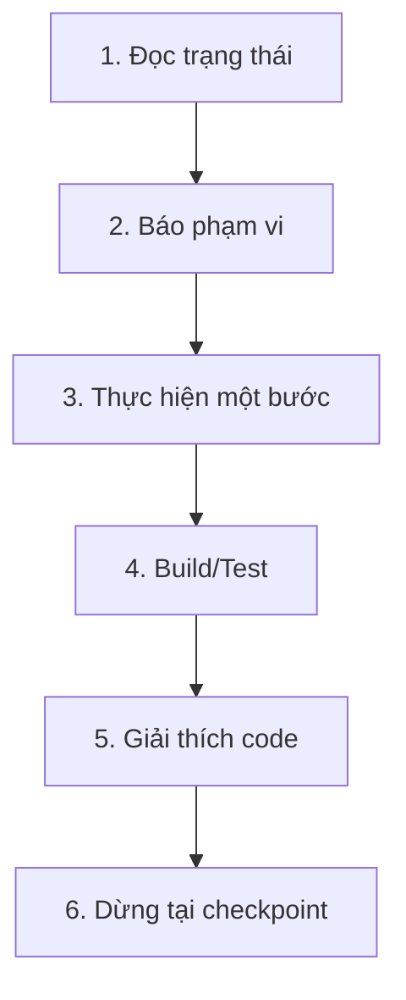

# EduHub Portal — Codex Step-by-Step Control Plan

> **Mục đích:** Buộc Codex triển khai dự án chậm, minh bạch và có checkpoint. Người dùng phải biết Codex sắp làm gì, vừa thay đổi gì, code chạy theo luồng nào và cách tự kiểm tra trước khi cho phép bước tiếp theo.
>
> **Lệnh vận hành quan trọng nhất:** **Mỗi lần chỉ thực hiện đúng một bước nhỏ trong tài liệu này. Hoàn tất, giải thích, kiểm thử rồi DỪNG. Không tự chuyển sang bước kế tiếp cho đến khi người dùng nói “tiếp tục”, “làm bước tiếp theo” hoặc chỉ định rõ bước khác.**

---

## 1. Thứ tự tài liệu Codex phải đọc

Trước khi sửa code, Codex phải đọc theo thứ tự:

1. `EduHub_01_Architecture_and_Code_Flows.md` — kiến trúc và luồng code.
2. `EduHub_02_Business_Rules_and_Test_Cases.md` — business rules và test cases.
3. `EduHub_03_Codex_Step_by_Step_Control_Plan.md` — cách chia bước, báo cáo và dừng.
4. `README.md`, `AGENTS.md`, `.editorconfig`, file solution/project và code hiện tại nếu đã tồn tại.

Nếu có mâu thuẫn:

- Business rule và security trong file 02 không được bỏ qua.
- Kiến trúc/tech stack trong file 01 không được tự thay thế.
- Cách triển khai theo từng checkpoint trong file 03 được ưu tiên để kiểm soát tốc độ.
- Nếu vẫn chưa rõ, Codex phải nêu mâu thuẫn và dừng hỏi, không tự đoán làm thay đổi kiến trúc.

---

## 2. Quy tắc vận hành bắt buộc dành cho Codex

### 2.1 Giới hạn phạm vi mỗi lượt

Mỗi lượt làm việc chỉ được chọn **một Micro-step ID**, ví dụ `P03-S02`.

Trong một micro-step, mặc định:

- Chỉ giải quyết một mục tiêu kỹ thuật hoặc một lát cắt nghiệp vụ nhỏ.
- Không triển khai nhiều feature độc lập cùng lúc.
- Không tự “tiện tay” refactor module ngoài phạm vi.
- Không tự sang micro-step tiếp theo dù còn thời gian.
- Không tạo toàn bộ dự án trong một lượt.
- Không thêm package/công nghệ ngoài specification nếu chưa giải thích nhu cầu.
- Nếu cần vượt phạm vi vì code không thể compile, phải nêu lý do và chỉ thêm thay đổi tối thiểu.

Giới hạn gợi ý cho một bước thông thường:

| Loại bước | Phạm vi tối đa gợi ý |
|---|---|
| Bootstrap/config | 1 vấn đề cấu hình, tối đa một nhóm file liên quan |
| Domain | 1 aggregate/value object hoặc 1 nhóm enum liên quan |
| Vertical slice | 1 command **hoặc** 1 query cùng validator/handler/endpoint/test |
| Infrastructure | 1 adapter/service, ví dụ Redis hoặc Refit gateway |
| Test | 1 nhóm rule/case liên quan |
| Refactor | 1 mục tiêu rõ ràng, behavior phải giữ nguyên |

Nếu một bước cần quá nhiều file, Codex phải chia tiếp thành `A`, `B`, `C`, ví dụ `P07-S02A`, rồi chỉ làm phần A.

### 2.2 Không được làm khi chưa được yêu cầu

Codex không được:

- Implement feature của phase sau.
- Đổi framework, database, kiến trúc hoặc package cốt lõi.
- Xóa migration, reset database hay xóa dữ liệu.
- Chạy lệnh destructive như reset/clean dữ liệu.
- Commit, push, tạo branch/PR nếu người dùng chưa yêu cầu.
- Sửa file không liên quan chỉ để format toàn bộ repository.
- Bỏ test đang fail hoặc disable rule để làm pipeline xanh.
- Hard-code secret, API key, connection string production hoặc rule chưa được xác nhận.
- Giả vờ đã kiểm thử khi chưa chạy được lệnh kiểm thử.

### 2.3 Quy tắc “giải thích trước – code sau – giải thích lại”

Mỗi micro-step phải đi qua đúng sáu trạng thái:



Không được gộp trạng thái 2 và 5 thành một câu chung chung.

---

## 3. Giao thức bắt đầu một micro-step

Trước khi chỉnh sửa file, Codex phải gửi một bản **Step Brief** ngắn theo mẫu:

```markdown
## Bước đang làm: <Micro-step ID> — <Tên>

- Mục tiêu: ...
- Vì sao cần bước này: ...
- File dự kiến tạo/sửa: ...
- Chưa làm trong bước này: ...
- Cách kiểm tra sau khi làm: ...
```

Sau đó Codex mới được sửa code. Nếu phát hiện phạm vi thực tế khác Step Brief, phải cập nhật cho người dùng trước khi mở rộng.

### 3.1 Kiểm tra trạng thái trước khi sửa

Codex phải:

1. Đọc `Progress Ledger` ở cuối tài liệu này.
2. Kiểm tra cây thư mục và thay đổi đang tồn tại.
3. Không ghi đè thay đổi của người dùng.
4. Xác định bước prerequisite gần nhất đã hoàn thành.
5. Đọc đúng rule IDs và test case IDs liên quan trong file 02.
6. Xác định luồng/section liên quan trong file 01.

Nếu prerequisite chưa hoàn thành, Codex phải đề xuất quay lại prerequisite thay vì viết code chắp vá.

---

## 4. Giao thức kết thúc một micro-step

Sau khi code, Codex phải trả một **Step Completion Report** theo đúng thứ tự sau.

### 4.1 Kết quả một câu

Nói rõ bước đã hoàn tất hay còn blocker. Không dùng câu mơ hồ như “đã xử lý cơ bản”.

### 4.2 File đã thay đổi

Dùng bảng:

| File | Tạo/Sửa | Vai trò | Thay đổi chính |
|---|---|---|---|
| `path/file.cs` | Tạo | ... | ... |

Phải liệt kê **tất cả** file đã chạm vào. Nếu tool tự sinh migration/lock file, cũng phải liệt kê.

### 4.3 Luồng code vừa tạo

Giải thích theo trình tự thực thi, ví dụ:

```text
HTTP Request
→ Carter endpoint
→ Mapster mapping
→ MediatR pipeline
→ Validator
→ Handler
→ PostgreSQL
→ Result/ProblemDetails
```

Chỉ giữ các mắt xích thực sự tồn tại trong bước đó; không tuyên bố đã có cache/event/job nếu chưa implement.

### 4.4 Giải thích code để người mới hiểu

Với mỗi class/interface quan trọng, phải trả lời:

1. File/class này dùng để làm gì?
2. Ai gọi nó?
3. Nó gọi tiếp thành phần nào?
4. Input và output là gì?
5. Business rule/test ID nào được bảo vệ?
6. Nếu bỏ nó đi thì lỗi gì xảy ra?

Không chỉ mô tả cú pháp. Phải giải thích vai trò trong luồng toàn hệ thống.

### 4.5 Kiểm thử đã chạy

Dùng bảng:

| Command | Kết quả | Ý nghĩa |
|---|---|---|
| `dotnet build ...` | PASS/FAIL/NOT RUN | ... |
| `dotnet test ...` | PASS/FAIL/NOT RUN | ... |

- Ghi đúng command thật sự đã chạy.
- Nếu FAIL, tóm tắt nguyên nhân và file liên quan.
- Nếu không thể chạy, ghi `NOT RUN` và lý do; không nói “đã bảo đảm chạy”.
- Không sửa lỗi unrelated ngoài phạm vi mà không báo trước.

### 4.6 Checkpoint và dừng

Cuối report phải có:

```markdown
### Checkpoint

- Trạng thái: Hoàn thành / Chưa hoàn thành / Bị chặn
- Bạn có thể tự kiểm tra bằng: ...
- Bước kế tiếp được đề xuất: <ID — tên>, nhưng **chưa thực hiện**.
- Codex dừng tại đây và chờ bạn yêu cầu tiếp tục.
```

---

## 5. Cách giải thích code bắt buộc

### 5.1 Ba tầng giải thích

Codex phải giải thích ở ba tầng, theo thứ tự:

1. **Nghiệp vụ:** Người dùng đang làm gì? Hệ thống bảo vệ rule nào?
2. **Luồng kỹ thuật:** Request đi qua những file/service nào?
3. **Code cụ thể:** Class, method và dòng logic quan trọng có nghĩa gì?

Ví dụ với sửa điểm:

- Nghiệp vụ: giáo viên chỉ được sửa điểm của lớp được phân công trong thời gian cho phép.
- Kỹ thuật: endpoint → command → validation/authorization → handler → PostgreSQL transaction → outbox.
- Code: validator kiểm tra range; handler load assignment; domain method đổi state; EF lưu history và event.

### 5.2 Khi dùng thuật ngữ

Lần đầu xuất hiện phải giải thích ngắn:

- `Command`: yêu cầu làm thay đổi dữ liệu.
- `Query`: yêu cầu chỉ đọc dữ liệu.
- `Handler`: nơi điều phối use case.
- `Pipeline Behavior`: lớp kiểm tra chéo trước/sau handler.
- `Outbox`: bảng giữ sự kiện cùng transaction để không thất lạc side effect.
- `Idempotency`: gửi lại cùng yêu cầu không tạo kết quả trùng.
- `Concurrency token`: phiên bản để ngăn hai người ghi đè dữ liệu nhau.

Không dùng thuật ngữ để thay thế phần giải thích.

### 5.3 Code walkthrough

Khi người dùng yêu cầu “giải thích kỹ”, Codex đi theo đúng thứ tự:

1. Entry point/endpoint.
2. Request và mapping.
3. Command/query.
4. Validator và authorization.
5. Handler.
6. Domain method/entity state.
7. Database/cache/event/external side effect.
8. Response và error cases.
9. Tests chứng minh.

---

## 6. Quy tắc thay đổi database và package

### 6.1 Database/migration

Một migration phải là một micro-step riêng hoặc phần cuối rõ ràng của đúng entity step.

Trước khi tạo migration, Codex phải nói:

- Bảng/cột/index/FK nào sẽ được thêm hoặc đổi.
- Dữ liệu hiện tại có bị ảnh hưởng không.
- `Up()` làm gì, `Down()` làm gì.
- Có rủi ro mất dữ liệu/lock table không.

Sau khi tạo migration, phải đọc lại migration tự sinh và giải thích; không chỉ tin tool.

Không chạy `database update` trên database không xác định. Mặc định chỉ dùng local Docker development database đã được người dùng cho phép.

### 6.2 NuGet/package

Mỗi lần thêm package phải ghi:

| Package | Project | Lý do | Dùng ở bước nào |
|---|---|---|---|
| Microsoft.EntityFrameworkCore 10.0.4 | EduHub.Application | `DbSet` contract cho application data access | P03-S01 |
| Npgsql.EntityFrameworkCore.PostgreSQL 10.0.3 | EduHub.Infrastructure | EF Core PostgreSQL provider | P03-S02 |
| Microsoft.EntityFrameworkCore.Design 10.0.4 | EduHub.Infrastructure | EF migration design-time tooling | P03-S04 |
| Testcontainers.PostgreSql 4.13.0 | EduHub.IntegrationTests | PostgreSQL isolated integration fixture | P03-S05 |
| MediatR 14.2.0 | EduHub.Application | CQRS request dispatch and pipeline behaviors | P04-S01 |
| FluentValidation.DependencyInjectionExtensions 12.1.1 | EduHub.Application | Validator discovery and request validation | P04-S02 |
| Carter 10.0.0 | EduHub.WebApi | Minimal API module convention | P04-S05 |
| Mapster.DependencyInjection 10.0.10 | EduHub.WebApi | Request-to-command mapping convention | P04-S05 |
| Microsoft.AspNetCore.Authentication.JwtBearer 10.0.4 | EduHub.WebApi | OpenAPI Bearer scheme contract | P04-S06 |
| System.IdentityModel.Tokens.Jwt 8.14.0 | EduHub.Infrastructure | JWT access token creation | P05-S02 |
| Swashbuckle.AspNetCore 10.2.2 | EduHub.WebApi | Swagger/OpenAPI documentation UI | P04-S06 |
| NetArchTest.Rules 1.3.2 | EduHub.ArchitectureTests | Layer and endpoint dependency rules | P04-S07 |

- Dùng central package management nếu solution đã chốt.
- Không thêm hai thư viện giải quyết cùng một việc nếu không có lý do.
- Kiểm tra compatibility .NET 10 trước khi chốt version.
- Không update hàng loạt package trong feature step.

---

## 7. Xử lý lỗi và blocker

### 7.1 Test/build fail do code trong bước hiện tại

Codex được phép sửa trong phạm vi micro-step đến khi test liên quan pass. Mọi lần sửa phải được tóm tắt trong report.

### 7.2 Fail đã có từ trước hoặc ngoài phạm vi

Codex phải:

1. Xác minh lỗi tồn tại và chỉ ra evidence.
2. Không tự sửa nếu sẽ mở rộng phạm vi đáng kể.
3. Báo bước hiện tại bị ảnh hưởng thế nào.
4. Đề xuất một micro-step sửa lỗi riêng.
5. Dừng chờ quyết định.

### 7.3 Requirement không rõ

Nếu ảnh hưởng business behavior, data loss, security hoặc public API, Codex phải hỏi trước. Nếu chỉ là chi tiết có thể cấu hình đã được file 02 liệt kê, dùng `Options`/fake adapter và ghi rõ giả định.

### 7.4 External service chưa có credential

Codex phải implement interface + fake/mock + contract tests trước; không hard-code credential và không gọi production.

---

## 8. Roadmap từng phase và micro-step

> Codex không được coi “một phase” là một lượt. Mỗi dòng `Sxx` là một checkpoint riêng; nếu dòng vẫn lớn, phải tách A/B/C.

### Phase 00 — Khảo sát và chốt baseline

| ID | Mục tiêu | Output tối thiểu | Check |
|---|---|---|---|
| P00-S01 | Đọc 3 spec và khảo sát workspace | Báo cáo file/cấu trúc hiện có, không sửa code | Không bỏ sót project/file quan trọng |
| P00-S02 | Lập traceability khởi đầu | Mapping phase → section/rule/test ID | Người dùng nhìn được toàn lộ trình |
| P00-S03 | Chốt baseline build/test | Chạy build/test hiện trạng nếu có | Ghi rõ PASS/FAIL trước khi sửa |

### Phase 01 — Bootstrap solution

| ID | Mục tiêu | Output tối thiểu | Chưa làm |
|---|---|---|---|
| P01-S01 | Tạo solution và 4 src projects | `.sln`, project files, references đúng dependency | Chưa cài toàn bộ package |
| P01-S02 | Tạo 3 test projects | Unit/Integration/Architecture test projects | Chưa viết feature tests |
| P01-S03 | Central package/config style | `Directory.Packages.props`, nullable, warnings | Chưa cấu hình DI nghiệp vụ |
| P01-S04 | Docker dependency skeleton | PostgreSQL, Redis, MongoDB health config | Chưa chạy migration |
| P01-S05 | WebApi startup tối thiểu | App boot + basic health endpoint | Chưa auth/database feature |

Checkpoint Phase 01: solution build xanh, containers dependency khởi động được, chưa có nghiệp vụ.

### Phase 02 — Shared kernel và error handling

| ID | Mục tiêu | Output tối thiểu |
|---|---|---|
| P02-S01 | Domain primitives | Base entity, domain event, UTC conventions |
| P02-S02 | Result/error model | Stable error code/result mapping |
| P02-S03 | Exception middleware | ProblemDetails + trace/correlation ID |
| P02-S04 | Pagination primitives | PagedResult, limit/sort conventions |
| P02-S05 | Unit tests shared kernel | Boundary/error mapping tests |

Checkpoint Phase 02: có nền error/response thống nhất nhưng chưa có feature.

### Phase 03 — PostgreSQL và EF Core foundation

| ID | Mục tiêu | Output tối thiểu |
|---|---|---|
| P03-S01 | `IApplicationDbContext` contract | Application abstraction |
| P03-S02 | `ApplicationDbContext` foundation | EF provider + naming/time conventions |
| P03-S03 | Identity entities/config | User, RefreshToken, unique index |
| P03-S04 | Initial migration | Migration được review và giải thích |
| P03-S05 | PostgreSQL integration test fixture | Testcontainers/local isolated DB |

Checkpoint Phase 03: connect/migrate/test PostgreSQL được; chưa login.

### Phase 04 — Application pipeline và Web API conventions

| ID | Mục tiêu | Output tối thiểu |
|---|---|---|
| P04-S01 | MediatR registration + request convention | Command/query marker |
| P04-S02 | FluentValidation behavior | Invalid request không vào handler |
| P04-S03 | Logging/performance behaviors | Structured scope/duration |
| P04-S04 | Transaction behavior | Command transaction boundary |
| P04-S05 | Carter + Mapster convention | Endpoint `ToHttpResult`, mapping config |
| P04-S06 | Swagger/OpenAPI base | JWT scheme, ProblemDetails example |
| P04-S07 | Architecture tests | Dependency/endpoint boundaries |

Checkpoint Phase 04: có đường ống request hoàn chỉnh; dùng test command/query giả để chứng minh.

### Phase 05 — Authentication và authorization

| ID | Mục tiêu | Rules/cases trọng tâm |
|---|---|---|
| P05-S01 | Password hasher + user seed development | AUTH-001..003 |
| P05-S02 | JWT token service | AUTH-004 |
| P05-S03 | Login vertical slice | AUTH-H01, AUTH-B01..04 |
| P05-S04 | Refresh rotation slice | AUTH-005..007, AUTH-E01 |
| P05-S05 | Logout slice | AUTH-H03 |
| P05-S06 | Role policies + CurrentUser | AUTH-008..010 |
| P05-S07 | Auth rate limit/security tests | AUTH-B05..08, AUTH-E02..03 |

Checkpoint Phase 05: login/refresh/logout và role policy chạy end-to-end.

### Phase 06 — Academic master data

| ID | Mục tiêu | Rules trọng tâm |
|---|---|---|
| P06-S01 | AcademicYear entity/config/tests | ACA-001 |
| P06-S02 | Create/List AcademicYear slices | ACA-H01, ACA-B01 |
| P06-S03 | Semester entity/range rules | ACA-002..004 |
| P06-S04 | Create/List Semester slices | ACA-B02 |
| P06-S05 | Subject entity/config | ACA-005..006 |
| P06-S06 | Subject CRUD/disable slices | ACA-H02..03, ACA-B03..04 |
| P06-S07 | Redis subject catalog để sau foundation Redis | Không tự triển khai tại bước này |

Checkpoint Phase 06: year/semester/subject đúng constraint PostgreSQL và API.

### Phase 07 — Students và parent access

| ID | Mục tiêu | Rules trọng tâm |
|---|---|---|
| P07-S01 | Student entity/config/migration | STU-001..005 |
| P07-S02 | CreateStudent slice | STU-H01, STU-B01..03, STU-E01 |
| P07-S03 | Get/ListStudent queries | role/scope/pagination |
| P07-S04 | UpdateStudent + concurrency | STU-H02, STU-E02 |
| P07-S05 | ParentStudent entity/config | STU-006..008 |
| P07-S06 | Link/unlink parent slices | STU-H03..04, STU-B04..06 |
| P07-S07 | Parent ownership authorization tests | AUTH-B07, SEC-004 |

Checkpoint Phase 07: hồ sơ và quyền parent–student được chứng minh bằng integration tests.

### Phase 08 — Class, assignment và enrollment

| ID | Mục tiêu | Rules trọng tâm |
|---|---|---|
| P08-S01 | ClassRoom entity/config | CLS-001 |
| P08-S02 | Class create/update/query slices | CLS-H01, CLS-B01 |
| P08-S03 | TeachingAssignment entity/config | CLS-002..004 |
| P08-S04 | Assign teacher slice + scope policy | CLS-H02, CLS-B02..03 |
| P08-S05 | Enrollment entity/config | ENR-001..005 |
| P08-S06 | Single enrollment slice | ENR-H01, ENR-B01..03 |
| P08-S07 | Capacity concurrency test/fix | ENR-E01 |
| P08-S08 | Bulk enrollment slice | ENR-006, ENR-H02, ENR-E02 |
| P08-S09 | Transfer/withdraw flow | ENR-H03, ENR-B04, ENR-E03 |

Checkpoint Phase 08: teacher scope và sĩ số không thể bị vượt bởi request đồng thời.

### Phase 09 — Grade configuration và GPA

| ID | Mục tiêu | Rules trọng tâm |
|---|---|---|
| P09-S01 | GradeComponent/config version | ACA-007..008 |
| P09-S02 | Component configuration slices | ACA-B05..06 |
| P09-S03 | GPA calculator unit tests trước | GPA-H/B/E cases |
| P09-S04 | GPA implementation | GPA-001..007 |
| P09-S05 | Classification policy options/version | Boundary/config tests |

Checkpoint Phase 09: toàn bộ công thức được chứng minh bằng unit test trước khi nhập điểm.

### Phase 10 — Grade state machine và core flows

| ID | Mục tiêu | Rules/cases trọng tâm |
|---|---|---|
| P10-S01 | GradeEntry + history entity/config | GRD-001..008, GRD-014 |
| P10-S02 | Domain state-machine tests trước | transitions Draft/Submitted/Published/Locked |
| P10-S03 | UpdateGrade command/validator | GRD-H01..02, GRD-B01..09 |
| P10-S04 | UpdateGrade endpoint + integration tests | AUTH/ownership/concurrency |
| P10-S05 | Idempotency storage/behavior | GRD-009, GRD-B18, GRD-E02 |
| P10-S06 | Bulk grade atomic slice | GRD-015..016, GRD-H03, GRD-B16..17 |
| P10-S07 | Submit gradebook | GRD-010, GRD-H04, GRD-B10..11 |
| P10-S08 | Publish gradebook | GRD-011..012, GRD-H05, GRD-B12..13 |
| P10-S09 | Reopen/republish | GRD-013/017, GRD-H06..07, GRD-B14 |
| P10-S10 | Lock grade job contract | GRD-H08, GRD-E07; Hangfire implementation ở Phase 13 |
| P10-S11 | Full failure/concurrency integration set | GRD-E01..09, DB-001..005 |

Checkpoint Phase 10: grade core hoàn chỉnh trong PostgreSQL/outbox record, chưa tuyên bố real-time/email/sync hoạt động.

### Phase 11 — Redis cache

| ID | Mục tiêu | Rules/cases trọng tâm |
|---|---|---|
| P11-S01 | `ICacheService` + Redis adapter | connection/fallback/serialization |
| P11-S02 | Cache key/version policy tests | CACHE-001..002, 005..007 |
| P11-S03 | Subject catalog cache | hit/miss/invalidation |
| P11-S04 | Published grade query cache | Parent view isolation |
| P11-S05 | Grade invalidation consumer | publish/reopen/republish |
| P11-S06 | Failure/stampede tests | CACHE-E01..04 |

Checkpoint Phase 11: đo được hit/miss; Redis down vẫn đọc PostgreSQL và không lộ draft.

### Phase 12 — Outbox và SignalR

| ID | Mục tiêu | Rules/cases trọng tâm |
|---|---|---|
| P12-S01 | Outbox entity/config/writer | SYS-005..006, DB-001 |
| P12-S02 | Outbox processor idempotency | DB-003 |
| P12-S03 | Notification entity/query/read | NTF-004/007 |
| P12-S04 | Authenticated SignalR hub | NTF-001..002 |
| P12-S05 | Published grade notification consumer | NTF-003..006 |
| P12-S06 | Online/offline/duplicate/failure tests | NTF-H/B/E cases |

Checkpoint Phase 12: published grade được lưu notification và push đúng user sau commit.

### Phase 13 — Hangfire jobs

| ID | Mục tiêu | Rules/cases trọng tâm |
|---|---|---|
| P13-S01 | Hangfire storage/dashboard security | JOB-001..003, SEC-010 |
| P13-S02 | Lock grade recurring job | JOB-H02, GRD-H08 |
| P13-S03 | Daily email digest + fake sender | JOB-004..005 |
| P13-S04 | Weekly Sunday 23:00 digest | timezone/idempotency |
| P13-S05 | Report job entity/status endpoint | RPT-001/004 |
| P13-S06 | PDF generation worker | RPT-002 |
| P13-S07 | Authorized/expiring download | RPT-003, SEC-011 |
| P13-S08 | Job crash/retry/concurrency tests | JOB/RPT edge cases |

Checkpoint Phase 13: dashboard bảo vệ, jobs idempotent, PDF async và download có quyền.

### Phase 14 — Refit + Polly Ministry integration

| ID | Mục tiêu | Rules/cases trọng tâm |
|---|---|---|
| P14-S01 | External contract + Refit interface | SYNC-001..003 |
| P14-S02 | DTO mapping contract tests | Versioned payload |
| P14-S03 | Polly timeout/retry policy | SYNC-004..005 |
| P14-S04 | Circuit breaker | SYNC-006, SYNC-E02/05 |
| P14-S05 | SyncRecord/idempotent consumer | SYNC-007, SYNC-E03/04 |
| P14-S06 | Admin manual retry | SYNC-008 |
| P14-S07 | Full fake-server contract tests | SYNC-H/B/E cases |

Checkpoint Phase 14: local grade không phụ thuộc external service; retry/circuit/idempotency được test.

### Phase 15 — Serilog + MongoDB audit

| ID | Mục tiêu | Rules/cases trọng tâm |
|---|---|---|
| P15-S01 | Serilog JSON/enrichers | AUD-001/006 |
| P15-S02 | Redaction policy/tests | AUD-002..003, SEC-012 |
| P15-S03 | Mongo sink/index/retention config | AUD-005/007 |
| P15-S04 | Grade audit correlation verification | AUD-004, AUD-H01 |
| P15-S05 | Mongo outage isolation test | AUD-E01 |

Checkpoint Phase 15: có structured audit an toàn và Mongo outage không phá transaction.

### Phase 16 — Quality gate và bàn giao

| ID | Mục tiêu | Output |
|---|---|---|
| P16-S01 | Full unit suite | Kết quả và test coverage quan trọng |
| P16-S02 | Full integration suite | PostgreSQL/Redis/Hangfire/API |
| P16-S03 | Contract/resilience suite | Ministry fake server |
| P16-S04 | Security/authorization regression | SEC/Auth/IDOR cases |
| P16-S05 | Swagger + Postman | Documented examples/tests |
| P16-S06 | Docker clean-start rehearsal | Clone/config/start/migrate/test |
| P16-S07 | Final traceability audit | Requirement → code → test, không thiếu tech |
| P16-S08 | README vận hành và code walkthrough | Người mới có thể chạy/hiểu hệ thống |

Checkpoint Phase 16: chỉ hoàn tất khi release checklist trong file 02 đạt yêu cầu.

---

## 9. Phase Gate — không được tự vượt qua

Kết thúc một phase, Codex phải tạo báo cáo gate:

```markdown
## Phase Gate: <Phase>

- Micro-steps hoàn thành: ...
- Business rules đã cover: ...
- Tests đang PASS: ...
- Tests FAIL/NOT RUN: ...
- Technical debt/TODO: ...
- Công nghệ đã thực sự hoạt động: ...
- Công nghệ mới chỉ có interface/mock: ...
- Demo/check thủ công: ...
- Đề xuất mở Phase tiếp theo: Có/Không
```

Sau báo cáo, Codex phải dừng. Chỉ bước sang phase mới khi người dùng yêu cầu.

---

## 10. Progress Ledger — Codex phải cập nhật sau mỗi bước

> Chỉ cập nhật một dòng tương ứng; không xóa lịch sử. Nếu repository dùng riêng `CHANGELOG` hoặc issue tracker sau này, ledger này vẫn giữ trạng thái checkpoint cấp cao.

### 10.1 Trạng thái hiện tại

| Trường | Giá trị ban đầu |
|---|---|
| Current phase | `Phase 09 — Grade configuration and GPA — CODE COMPLETED` |
| Current micro-step | `P09-S01..S05 — Grade components, GPA calculator, classification policy foundation` |
| Last completed step | `P09-S01..S05 — Grade configuration and GPA foundation` |
| Build status | `NOT RUN — Phase 09 awaits explicit Build authorization` |
| Test status | `NOT RUN` |
| Known blockers | `Build/test, capacity concurrency test, and database update await explicit authorization.` |
| Next proposed step | `Build Phase 09` |

### 10.2 Lịch sử micro-step

| Ngày/giờ | Step ID | Trạng thái | File chính | Build/Test | Ghi chú |
|---|---|---|---|---|---|
| 2026-07-13 | P00-S01 | COMPLETED | `C:\Users\ADMIN\Desktop\EduHub` | NOT RUN | Đã đọc 3 specification và khảo sát workspace. |
| 2026-07-13 | P00-S02 | COMPLETED | 3 specification | NOT RUN | Đã lập mapping phase → architecture/rule/test. |
| 2026-07-13 | P00-S03 | COMPLETED | Workspace baseline | NOT RUN | Chưa có `.sln`/`.csproj`, không có target để build hoặc test. |
| 2026-07-13 | P01-S01 | COMPLETED | `EduHub.sln`, `src/` | NOT RUN | Đã tạo 4 src projects và dependency direction. |
| 2026-07-13 | P01-S02 | COMPLETED | `tests/` | NOT RUN | Đã tạo Unit, Integration và Architecture test projects. |
| 2026-07-13 | P01-S03 | COMPLETED | Directory build/package config | NOT RUN | .NET 10, C# 14, nullable, analyzer và central test package versions. |
| 2026-07-13 | P01-S04 | COMPLETED | Docker Compose skeleton | NOT RUN | PostgreSQL, Redis và MongoDB health checks; host ports tránh service local. |
| 2026-07-13 | P01-S05 | COMPLETED | `Program.cs` | NOT RUN | Đã cấu hình minimal health endpoint `/health`. |
| 2026-07-13 | P02-S01 | COMPLETED | Domain common | NOT RUN | UUID, UTC audit timestamps, domain events và DomainException. |
| 2026-07-13 | P02-S02 | COMPLETED | Application common models | NOT RUN | Result/Error model với stable error code/type. |
| 2026-07-13 | P02-S03 | COMPLETED | Exception middleware | NOT RUN | Safe ProblemDetails cho bad request, conflict và unexpected error. |
| 2026-07-13 | P02-S04 | COMPLETED | Pagination models | NOT RUN | Page size 20/100, trim search và sort allow-list contract. |
| 2026-07-13 | P02-S05 | COMPLETED | Unit test shared kernel | NOT RUN | Domain, result, pagination và error-safety test cases đã tạo. |
| 2026-07-13 | P03-S01 | COMPLETED | `IApplicationDbContext` | NOT RUN | Application data contract cho User và RefreshToken. |
| 2026-07-13 | P03-S02 | COMPLETED | `ApplicationDbContext` | NOT RUN | Npgsql provider, decimal precision, UTC timestamp mapping và DI registration. |
| 2026-07-13 | P03-S03 | COMPLETED | Identity entities/config | NOT RUN | User/RefreshToken, unique normalized email/token hash và FK mapping. |
| 2026-07-13 | P03-S04 | COMPLETED | InitialIdentity migration | PASS / NOT RUN | Migration đã generate và review; chưa chạy database update. |
| 2026-07-13 | P03-S05 | COMPLETED | PostgreSQL integration fixture | PASS / NOT RUN | Testcontainers fixture sẽ tạo PostgreSQL isolated và chạy migration khi Test được authorize. |
| 2026-07-13 | P04-S01 | COMPLETED | MediatR registration + CQRS contracts | NOT RUN | ICommand/IQuery và MediatR pipeline registration. |
| 2026-07-13 | P04-S02 | COMPLETED | ValidationBehavior | NOT RUN | FluentValidation chạy trước handler; exception middleware trả validation ProblemDetails. |
| 2026-07-13 | P04-S03 | COMPLETED | Logging/Performance behaviors | NOT RUN | Structured request name, trace ID và duration; không log request body. |
| 2026-07-13 | P04-S04 | COMPLETED | TransactionBehavior | NOT RUN | Command transaction boundary; failure Result/exception rollback. |
| 2026-07-13 | P04-S05 | COMPLETED | Carter + Mapster + ToHttpResult | NOT RUN | Pipeline probe command/query chứng minh endpoint convention. |
| 2026-07-13 | P04-S06 | COMPLETED | Swagger/OpenAPI base | NOT RUN | Development-only Swagger UI, Bearer scheme và ProblemDetails example. |
| 2026-07-13 | P04-S07 | COMPLETED | Architecture tests | NOT RUN | Domain/Application dependency và Carter module DbContext boundary rules. |
| 2026-07-13 | P04-BUILD | COMPLETED | Phase 4 compile fixes | PASS / NOT RUN | Fixed MediatR cancellation forwarding, Carter usings, and OpenAPI v2 namespace changes. |
| 2026-07-13 | P05-S01 | COMPLETED | Password hash + development seed | PASS / NOT RUN | PBKDF2-SHA512 password hash and idempotent development admin seed. |
| 2026-07-13 | P05-S02 | COMPLETED | JWT token service | PASS / NOT RUN | Access token contains user ID, role, issuer, audience, expiry, JTI, and security stamp. |
| 2026-07-13 | P05-S03 | COMPLETED | Login vertical slice | PASS / NOT RUN | Login normalizes email, verifies hash, blocks inactive user, and returns token pair. |
| 2026-07-13 | P05-S04 | COMPLETED | Refresh rotation slice | PASS / NOT RUN | Refresh token stored as hash and rotated with reuse family revocation path. |
| 2026-07-13 | P05-S05 | COMPLETED | Logout slice | PASS / NOT RUN | Authenticated logout revokes only the supplied current refresh token. |
| 2026-07-13 | P05-S06 | COMPLETED | Role policies + CurrentUser | PASS / NOT RUN | JWT fallback auth, role policies, CurrentUser, and DB status/security-stamp validation. |
| 2026-07-13 | P05-S07 | PARTIAL | Auth rate limit/security tests | PASS / NOT RUN | Login 429 rate-limit wiring added; test cases not created per AGENTS.md instruction. |
| 2026-07-13 | REORG-01 | COMPLETED | Interfaces/Services folder split | NOT RUN | Application interfaces and Infrastructure services separated for readability; logic unchanged. |
| 2026-07-13 | P06-S01 | COMPLETED | AcademicYear entity/config/migration | NOT RUN | AcademicYear date-range check and unique normalized name. |
| 2026-07-13 | P06-S02 | COMPLETED | Create/List AcademicYear slices | NOT RUN | Carter endpoints and CQRS handlers for academic years. |
| 2026-07-13 | P06-S03 | COMPLETED | Semester entity/range rules | NOT RUN | Semester FK, year-boundary validation, overlap detection, and date checks. |
| 2026-07-13 | P06-S04 | COMPLETED | Create/List Semester slices | NOT RUN | Carter endpoints and CQRS handlers for semesters. |
| 2026-07-13 | P06-S05 | COMPLETED | Subject entity/config/migration | NOT RUN | Subject code uniqueness, credits/max score checks, and soft-disable flag. |
| 2026-07-13 | P06-S06 | COMPLETED | Subject CRUD/disable slices | NOT RUN | Create/list/update/disable subject endpoints and handlers. |
| 2026-07-13 | P06-S07 | SKIPPED | Redis subject catalog | NOT RUN | Redis subject catalog intentionally deferred by Phase 06 spec. |
| 2026-07-13 | P07-S01 | COMPLETED | Student entity/config/migration | NOT RUN | StudentCode normalized unique, DOB/profile fields, status, and version concurrency token. |
| 2026-07-13 | P07-S02 | COMPLETED | CreateStudent slice | NOT RUN | AcademicAdmin-only endpoint and handler with normalized code uniqueness and DOB validation. |
| 2026-07-13 | P07-S03 | COMPLETED | Get/ListStudent queries | NOT RUN | Read scope allows Admin all and Parent only active linked students; unauthorized scope returns no data. |
| 2026-07-13 | P07-S04 | COMPLETED | UpdateStudent slice | NOT RUN | Version check before update and status/profile change handling. |
| 2026-07-13 | P07-S05 | COMPLETED | ParentStudent entity/config | NOT RUN | Unique parent-student pair, active flag, effective dates, and deactivate history. |
| 2026-07-13 | P07-S06 | COMPLETED | Link/unlink parent slices | NOT RUN | Parent user must be active Parent role; unlink deactivates link instead of deleting. |
| 2026-07-13 | P07-S07 | PARTIAL | Parent ownership authorization tests | NOT RUN | Ownership enforcement implemented in query scope; tests not created per AGENTS.md instruction. |
| 2026-07-13 | P08-S01 | COMPLETED | ClassRoom entity/config | NOT RUN | Class code unique per academic year; capacity and grade level check constraints. |
| 2026-07-13 | P08-S02 | COMPLETED | ClassRoom slices | NOT RUN | Create/update/list class APIs with duplicate code and capacity validation. |
| 2026-07-13 | P08-S03 | COMPLETED | TeachingAssignment entity/config | NOT RUN | Teacher-class-subject-semester assignment with active-scope unique index. |
| 2026-07-13 | P08-S04 | COMPLETED | AssignTeacher slice | NOT RUN | Teacher, subject, class and semester scope validation added. |
| 2026-07-13 | P08-S05 | COMPLETED | Enrollment entity/config | NOT RUN | Enrollment status, active unique enrollment and class capacity counter added. |
| 2026-07-13 | P08-S06 | COMPLETED | Single enrollment slice | NOT RUN | Active student enrollment validates scope and reserves class capacity atomically. |
| 2026-07-13 | P08-S07 | PARTIAL | Capacity concurrency fix | NOT RUN | Atomic capacity increment implemented; concurrency test not created per AGENTS.md instruction. |
| 2026-07-13 | P08-S08 | COMPLETED | Bulk enrollment slice | NOT RUN | Partial-success bulk enrollment rejects duplicate student IDs in payload. |
| 2026-07-13 | P08-S09 | COMPLETED | Transfer/withdraw flow | NOT RUN | Transfer closes old enrollment and creates new enrollment in one transaction; withdraw requires reason. |
| 2026-07-13 | REORG-02 | COMPLETED | Services/Repositories/Handlers | NOT RUN | Refactored business features to Feature Handler -> Service Interface -> Application Service -> Repository Interface -> Infrastructure Repository -> DbContext. |
| 2026-07-13 | REORG-03 | COMPLETED | WebApi Dtos/Mappings/ResultExtensions/Modules | NOT RUN | Moved API request/response contracts to DTO folders, moved API mapping to Mappings, wrapped data success responses with ApiResponse, and removed raw Application response path from modules. |
| 2026-07-13 | REORG-04 | COMPLETED | WebApi query DTOs/Mappings/Modules | NOT RUN | Added request DTOs and ToQuery mappings for GET/list endpoints; WebApi modules no longer create Application Command/Query objects directly. |
| 2026-07-13 | REORG-05 | COMPLETED | Application Contracts/UnitOfWork/WebApi csproj | NOT RUN | Removed Mapster package references, changed transaction pipeline to IUnitOfWork abstraction, and moved Application Command/Query/Response contracts out of Features. |
| 2026-07-13 | P09-S01..S05 | COMPLETED | GradeComponent/GPA/GradeConfigurations API | NOT RUN | Added grade component version configuration, GPA decimal calculator, default classification policy version, API DTO/mapping/module, repository/service, and migration/snapshot. Tests not created per AGENTS.md instruction. |

Quy ước trạng thái: `PLANNED`, `IN_PROGRESS`, `COMPLETED`, `BLOCKED`, `REWORK_REQUIRED`.

Codex chỉ đánh dấu `COMPLETED` khi:

- code trong scope đã xong;
- build/test bắt buộc đã chạy hoặc lý do NOT RUN được người dùng chấp nhận;
- Step Completion Report đã cung cấp;
- ledger được cập nhật.

---

## 11. Mẫu lệnh người dùng để điều khiển Codex

Người dùng có thể dùng các câu ngắn sau:

### Bắt đầu

```text
Đọc 3 file EduHub specification. Chỉ làm P00-S01, báo cáo theo Step Completion Report và dừng.
```

### Tiếp tục đúng một bước

```text
Tôi đã kiểm tra checkpoint. Làm đúng micro-step kế tiếp, không làm sang bước sau.
```

### Yêu cầu giải thích lại

```text
Chưa code tiếp. Hãy giải thích lại luồng của bước vừa làm từ endpoint đến database và vai trò từng file cho người mới.
```

### Kiểm tra code không sửa

```text
Chỉ review bước vừa hoàn thành theo rule/test ID. Không sửa code. Liệt kê thiếu sót và rủi ro.
```

### Yêu cầu sửa trong scope

```text
Chỉ sửa các lỗi của checkpoint hiện tại, chạy lại test và dừng. Không mở rộng feature.
```

### Tạo phase gate

```text
Chưa sang phase mới. Hãy lập Phase Gate report và chỉ ra những gì thực sự chạy được so với mock/interface.
```

---

## 12. Checklist để người dùng kiểm soát mỗi lượt

Sau khi Codex dừng, người dùng chỉ cần kiểm tra:

- [ ] Codex có làm đúng một Micro-step ID không?
- [ ] Có nói rõ file nào được tạo/sửa không?
- [ ] Có giải thích request đi qua code như thế nào không?
- [ ] Có liên kết business rule/test ID không?
- [ ] Có chạy build/test thật và báo đúng kết quả không?
- [ ] Có làm thêm feature ngoài phạm vi không?
- [ ] Có migration/package/secret nào xuất hiện mà chưa giải thích không?
- [ ] Progress Ledger đã được cập nhật chưa?
- [ ] Bước tiếp theo mới chỉ được đề xuất, chưa bị tự động thực hiện phải không?

Nếu một ô chưa đạt, yêu cầu Codex hoàn thiện checkpoint hiện tại trước khi nói “tiếp tục”.

---

## 13. Chỉ dẫn cuối cùng cho Codex

1. Tốc độ không quan trọng bằng khả năng kiểm tra và hiểu code.
2. Một response dài không thay thế cho việc chia code thành bước nhỏ.
3. Không tuyên bố một công nghệ đã hoàn thành nếu mới chỉ cài package hoặc tạo interface.
4. Mỗi feature phải được chứng minh bằng test tương ứng với rule/case ID.
5. Luôn phân biệt rõ: **đã code**, **đã build**, **đã test**, **đã demo**, **mới đề xuất**.
6. Không che giấu test fail, warning, workaround hoặc technical debt.
7. Khi người dùng hỏi về code vừa làm, ưu tiên giải thích; không tự động code tiếp.
8. Hoàn thành một checkpoint thì dừng. Chính người dùng quyết định thời điểm sang bước mới.

---

## 14. Progress extension — School/People/Gradebook/Report approval

### 14.1 Quyết định đã chốt

- `single-school`; school profile cấu hình dùng chung.
- `SystemAdmin -> accounts/security`.
- `AcademicAdmin -> academic operations/links/approval`.
- `Teacher -> gradebook + student remark`; bỏ LMS/chấm bài online.
- `Parent -> ReportRequest -> AcademicAdmin review -> Hangfire PDF`.
- Search: server-side normalized search + frontend debounce 300ms; không gọi polling cho search.

### 14.2 Backend checkpoint

| Step | Status | Deliverable |
|---|---|---|
| `P17-S01` | CODED | User profile fields + People API + role boundary |
| `P17-S02` | CODED | SchoolProfile config/read API |
| `P17-S03` | CODED | Student normalized search, class/guardian filters, detail, child list |
| `P17-S04` | CODED | Teacher/admin TeachingAssignment read APIs |
| `P17-S05` | CODED | Bounded Gradebook API + StudentRemark |
| `P17-S06` | CODED | Published grade context enrichment |
| `P17-S07` | CODED | ReportRequest approval workflow + outbox notifications |
| `P17-S08` | CODED | QuestPDF report generator scoped by semester |
| `P17-S09` | VERIFIED | EF migration `20260714100614_AddSchoolPeopleGradebookAndReportRequests` |
| `P17-S10` | VERIFIED | EF model snapshot regenerated; Integration Tests pass |

### 14.3 Frontend checkpoint

| Step | Status | Deliverable |
|---|---|---|
| `P18-S01` | CODED | Role navigation for Parent/Teacher/AcademicAdmin/SystemAdmin |
| `P18-S02` | CODED | Parent child cards + school/class/semester context |
| `P18-S03` | CODED | Student table class column/filter, normalized debounced search, detail dialog |
| `P18-S04` | CODED | Parent linking from Student detail |
| `P18-S05` | CODED | People management/read-only split by role |
| `P18-S06` | CODED | Class assignment Teacher/Subject/Semester UI |
| `P18-S07` | CODED | Teacher gradebook dynamic table + bulk save + remarks + submit |
| `P18-S08` | CODED | Academic gradebook review/publish/reopen/lock |
| `P18-S09` | CODED | Parent ReportRequest form/history + Academic approval inbox |
| `P18-S10` | CODED | Published grade full context + teacher remark |
| `P18-S11` | BUILD PASS | TypeScript typecheck và Next production build cho site/portal |

### 14.4 File-flow reference

```text
Parent children:
StudentsModule -> ListMyChildrenQueryHandler -> IStudentService
-> StudentService -> IStudentRepository -> StudentRepository -> PostgreSQL

Teacher gradebook:
GradesModule -> GetGradebookQueryHandler -> IGradeEntryService
-> GradeEntryService -> IGradeEntryRepository -> GradeEntryRepository -> PostgreSQL

Report approval:
ReportsModule -> ReviewReportRequestCommandHandler -> IReportService
-> ReportService -> IReportJobRepository -> ReportJobRepository
-> Hangfire -> SimplePdfReportGenerator -> OutboxProcessor -> SignalR/Email
```

### 14.5 Gate hiện tại

- Trạng thái: **Backend build pass; 22/22 .NET tests pass; Frontend typecheck/build pass**.
- Không được tuyên bố compile/test pass trước khi người dùng ra lệnh `Build đi` hoặc `Test đi`.
- Build gate tiếp theo:
  1. `dotnet build` solution.
  2. Regenerate/verify EF migration snapshot nếu model mismatch.
  3. `pnpm --filter @eduhub/portal build`.
  4. Chỉ chạy test suite khi có lệnh Test riêng.
  5. Swagger/manual browser flow sau khi build pass.
- Postman: bỏ qua ở checkpoint hiện tại theo yêu cầu người dùng.

## 15. Progress extension — Search/Class filter/Docker route alignment

| Step | Status | Deliverable |
|---|---|---|
| `P19-S01` | CODED | Student/Class/Subject search dùng case-insensitive PostgreSQL matching phù hợp normalized data. |
| `P19-S02` | CODED | SystemAdmin portal bỏ academic navigation, metrics và API dashboard không cần thiết. |
| `P19-S03` | CODED | Student class filter hai cấp `GradeLevel -> ClassRoom`, có sĩ số/sức chứa. |
| `P19-S04` | DOCUMENTED | Architecture/business rules/control plan đồng bộ contract search, current class và Docker image lifecycle. |

### 15.1 Gate P19

- Trạng thái: **BUILD/DEPLOY VERIFIED ngày 2026-07-15**.
- Backend và frontend production build pass; Docker API đã rebuild từ source mới.
- Search/class picker vẫn cần browser regression chi tiết trên từng role và viewport khi chạy full test gate.

## 16. Progress extension — Security and consistency hardening

| Step | Status | Deliverable |
|---|---|---|
| `P20-S01` | CODED | Bỏ account UUID khỏi UI; logout revoke refresh token không phụ thuộc access token. |
| `P20-S02` | CODED | Health details/diagnostics yêu cầu SystemAdmin; public liveness sanitized. |
| `P20-S03` | CODED | API/Site/Portal security headers; Docker loopback binding; Redis authentication. |
| `P20-S04` | CODED | PBKDF2 220k + login rehash; validator account; self/last-admin và active-link invariant. |
| `P20-S05` | CODED | Report transactional outbox, payload idempotency và outbox `SKIP LOCKED`. |
| `P20-S06` | CODED | Email delivery retry state machine + migration; open report-request partial unique index. |
| `P20-S07` | CODED | Grade-entry window, post-commit cache invalidation và EF conflict `409`. |
| `P20-S08` | CODED | Workspace override loại `postcss 8.4.31`; lockfile chỉ còn `8.5.19`. |
| `P20-S09` | DOCUMENTED | Đồng bộ architecture, business rules, migration và release blockers. |
| `P20-S10` | CODED | Report PDF v3 áp dụng `IGpaCalculator`: subject average, semester GPA, classification policy. |
| `P20-S11` | VERIFIED | Portal BFF chọn thuộc tính `Secure` theo request/forwarded protocol; local HTTP login/refresh/logout hoạt động, deploy HTTPS vẫn dùng secure cookie. |

### 16.1 Gate P20

- Trạng thái: **BUILD/CLOUD-CONNECTION VERIFIED ngày 2026-07-15; full automated test gate chưa chạy trong lượt này**.
- `dotnet build .\EduHub.sln`: pass, `0 warning`, `0 error`.
- Migration `20260715120000_HardenEmailAndReportProcessing`: đã apply trên Neon PostgreSQL.
- Frontend Site/Portal production build: pass, TypeScript pass.
- Compose rebuild: pass; Neon PostgreSQL, Redis local và MongoDB Atlas healthy; PostgreSQL/Mongo local chuyển sang profile `local-databases` và không chạy mặc định.
- Smoke: API liveness, Swagger, admin login/current-user/ready health và Portal BFF login/refresh/logout đều pass.
- Còn phải chạy full unit/architecture/integration/contract/security regression để đóng release gate.
- Không được coi secret rotation, TLS, backup hoặc Ministry sandbox là hoàn thành chỉ vì cloud connection gate pass.

## 17. Progress extension — Curriculum, scheduling, profile và import

| Step | Status | Deliverable |
|---|---|---|
| `P21-S01` | BUILD VERIFIED | Curriculum plan/quota, teacher capability, homeroom, timetable version/entry domain + EF configuration. |
| `P21-S02` | MIGRATED | EF-generated migration `20260715072650_AddCurriculumTimetableAndProfiles` đã apply lên Neon. |
| `P21-S03` | BUILD VERIFIED | `Feature -> Service -> Repository` scheduling slices và OR-Tools CP-SAT generator. |
| `P21-S04` | BUILD VERIFIED | Scheduling Carter APIs: plan, capability, GVCN, generate/version/entry/publish/move/lock. |
| `P21-S05` | BUILD VERIFIED | Student profile correction + R2 presigned upload/local fallback + AcademicAdmin review. |
| `P21-S06` | BUILD VERIFIED | ClosedXML template/import Student + Parent + link + Enrollment, row-level result. |
| `P21-S07` | SEEDED | Neon development seed: môn THPT, 9 lớp, 270 học sinh, tài khoản theo role và 3 curriculum plans. |
| `P21-S08` | BUILD VERIFIED | Portal production build có timetable theo role, student profile, profile approval, Excel import và scheduling workspace. |
| `P21-S09` | DOCUMENTED | Architecture, business rules, test catalogue và route flow đồng bộ. |

### 17.1 Gate P21

- Trạng thái: **Backend Docker build, Neon migration/seed và frontend production build PASS; full test suite chưa chạy**.
- Runtime checkpoint 2026-07-15: sửa miền slot OR-Tools để Thứ Bảy tiết 5 chỉ dành cho sinh hoạt lớp; sinh và công bố TKB HK1 gồm 513 tiết, 144 phân công tự động.
- Bắt buộc khi nhận lệnh Build:
  1. `dotnet build .\EduHub.sln`.
  2. `ApplicationDbContextModelSnapshot` đã regenerate và migration P21 đã apply thành công lên Neon.
  3. `pnpm --filter @eduhub/portal build`.
- Bắt buộc khi nhận lệnh Test:
  1. Unit test curriculum/profile/import validators và domain transitions.
  2. PostgreSQL integration test migration + import + profile approval.
  3. Scheduling constraint tests: conflict, adjacent double, Wed/Sat, teacher/class scope.
  4. Browser role smoke cho 7 route mới.

## 18. Progress extension — Teaching-week timetable refactor

| Step | Status | Deliverable |
|---|---|---|
| `P22-S01` | BUILD VERIFIED | Thay chu kỳ A/B bằng tuần 1..N, khoảng ngày và tuần hiện tại. |
| `P22-S02` | BUILD VERIFIED | Khung giờ sáng 07:15, chiều 13:15; 45 phút/tiết, chuyển tiết 5 phút. |
| `P22-S03` | BUILD VERIFIED | OR-Tools bắt buộc đủ 29 tiết sáng; buổi chiều nếu mở phải đủ 5 tiết. |
| `P22-S04` | BUILD VERIFIED | Chỉnh tay bằng hoán đổi slot; đổi giáo viên đồng bộ assignment/toàn bộ lớp-môn với capability/conflict/load checks. |
| `P22-S05` | BUILD VERIFIED | Portal chọn tuần theo ngày, về tuần hiện tại và nhóm capability theo giáo viên/môn. |
| `P22-S06` | APPLIED / SEEDED | Migration `20260715153000_ReplaceCycleWeeksWithTeachingWeeks` đã apply Neon; unique active class-subject-semester và seed đã xác minh. |
| `P22-S07` | DOCUMENTED | Architecture, business rules, test catalogue và README đồng bộ. |
| `P22-S08` | APPLIED / VERIFIED | Corrective migration chuẩn hóa tiết chiều legacy 6/7 thành 1/2, thêm DB constraint và endpoint thực tế trả 200. |
| `P22-S09` | CONFIGURED | Local `.NET` và Docker API cùng cổng 8080, cùng external DB/config; launcher local đổi đúng Redis/path và chặn chạy trùng API. |
| `P22-S10` | STATIC VERIFIED | Fresh-clone local DB bootstrap, tool manifest, secret-safe Git boundary và UTF-8 Vietnamese cleanup. |

### 18.1 Gate P22

- Build solution, Site và Portal: PASS ngày 2026-07-15.
- Neon migration + development seed + Docker API rebuild: PASS.
- Smoke: API live/Swagger, route tuần/đổi giáo viên, Site và Portal: PASS.
- Legacy timetable endpoint: PASS, 29 entries, period range 1..5.
- Còn lại khi có lệnh Test: full scheduling unit/integration tests, solver feasibility và browser role flow.

## 19. Progress extension — Repository and local Docker delivery

| Step | Status | Deliverable |
|---|---|---|
| `P23-S01` | CODE COMPLETE | API startup tách khỏi development seed; thêm `EduHub.DatabaseManager` cho migrate/seed. |
| `P23-S02` | CODE COMPLETE | Backend Compose local gồm PostgreSQL, MongoDB, Redis, migrate gate, API và optional seed profile. |
| `P23-S03` | CODE COMPLETE | Backend/Frontend được đóng gói thành hai workspace `BE/` và `FE/` trong cùng monorepo, với ignore, CI, Dependabot, security policy và PR template dùng chung. |
| `P23-S04` | CODE COMPLETE | Frontend Site/Portal có standalone Docker images và dùng chung network `eduhub-dev` với Backend. |
| `P23-S05` | VERIFIED | Backend build `0 warning/error`, `22/22` tests, Frontend typecheck/lint/build, vulnerability audits, Docker migration + seed idempotency + health/BFF smoke PASS ngày 2026-07-21. |

## 20. Progress extension — DevExpress system analytics

| Step | Status | Deliverable |
|---|---|---|
| `P24-S01` | CODED | DevExpress 26.1 Dashboard/Reporting/Skia + React packages, SystemAdmin-only restricted controllers và secret-safe local/Docker/CI license pipeline. |
| `P24-S02` | CODED | SystemAdmin analytics contracts, repository/service, MediatR features và 3 API datasets Overview/Academic/Data Quality. |
| `P24-S03` | CODED | `/admin` dùng DevExtreme KPI, semester filter, charts và grids cho Overview/Academic/Data Quality. |
| `P24-S04` | CODED | Monitoring API và System Health dashboard cho Redis, Hangfire, Outbox, integration, email, reports. |
| `P24-S05` | CODED | Catalog 3 Programmatic XtraReport, gồm 2 report dùng GroupHeaderBand, React Web Document Viewer và export PDF/XLSX/CSV theo reportType. |
| `P24-S06` | CODED | Bearer-aware BFF, Docker origin fix, SystemAdmin authorization và weekly Hangfire HTML digest. |
| `P24-S07` | CODED / NOT RUN | Integration tests, Docker fonts/config và documentation gate đã thêm; chưa chạy Build/Test/Docker. |
| `P25-S01` | VERIFIED / SEEDED | DatabaseManager đã build sạch và seed idempotent vào Neon `neondb`; API HK2 xác minh 270 học sinh, 9 lớp, 24 môn và 1.296 GradeEntry đủ bốn trạng thái. |
| `P25-S02` | CODED / UI CHECKED | Portal đồng bộ DevExtreme/Analytics Light-Dark theme và tăng độ đọc chữ phụ; login Light/Dark đã kiểm tra trực quan. |

### 20.1 Gate P24-S01

- Source/config hoàn tất; chưa tuyên bố build/test pass trước lệnh xác nhận của người dùng.
- GitHub Actions cần repository secret `DevExpressLicenseKey`; mỗi developer cần license DevExpress hợp lệ riêng.
- Trial hiện tại sinh cảnh báo/watermark `DX1000`; lỗi thiếu/sai license vẫn không được hạ cấp.

### 20.2 Gate P24-S02

- Luồng code: `API DTO/Mapping -> MediatR -> Service -> Repository -> PostgreSQL`.
- Academic dataset dùng điểm Published/Locked chuẩn hóa thang 10; Data Quality chỉ đọc, không tự sửa.
- Không có thay đổi database schema và không tạo migration.
- Source hoàn tất; chờ lệnh riêng để Build/Test trước khi chuyển `VERIFIED`.

### 20.3 Gate P24-S03..S07

- Portal routes: `/admin`, `/admin/reports`, `/admin/system-health`.
- DevExpress 26.1 versions đồng nhất giữa NuGet/npm; report viewer dùng endpoint `/DXXRDV` qua BFF và chọn giữa Executive Summary, Academic by Grade, Data Quality.
- Weekly digest: thứ Hai `06:30`, timezone Việt Nam, chỉ SystemAdmin active.
- Docker runtime thêm `fonts-dejavu-core`; license vẫn chỉ mount ở build stage.
- Integration tests đã code cho `401/403`, ba datasets, monitoring và PDF signature.
- Chưa chạy restore/build/test/frontend build/Docker rehearsal theo checkpoint người dùng.
